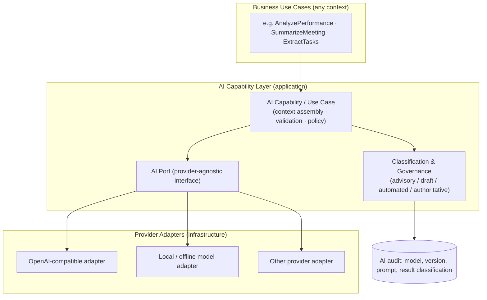

# Tekarai — AI Architecture

**Status:** Authoritative (Phase 02 — Architecture & ADRs)
**Related ADRs:** ADR-013 (decisive), ADR-008, ADR-016
**Detailed implementation specs:** Phase 13 (AI platform), Phase 16
(self-learning), Phase 17 (project intelligence).

---

## 1. AI Architecture Diagram (Phase 02 §28)

## 2. Rules

1. **Never** `Domain → OpenAI API` or `Domain → Local LLM`. Access is always:
   `AI Capability → AI Port → Provider Adapter` (ADR-013).
2. Providers are interchangeable configuration; switching a provider must
   not touch domain or application code.
3. **Authorization before inference:** the context builder includes only
   data the requesting principal may use; RAG retrieval is permission-filtered
   **before** context assembly (Data Flow §12).
4. **Output classification is mandatory:** advisory / draft / automated /
   authoritative. Authoritative changes need explicit business rules and
   authorization — AI never silently overwrites business records.
5. Every AI result records model, model version, prompt (versioned) and
   classification for governance and cost analysis.
6. Separation of concerns: model providers · prompt definitions · AI use
   cases · model configuration · inference execution · knowledge retrieval ·
   audit/governance are distinct modules of the AI capability (Phase 13).

## 3. Platform AI Capabilities (target list from the master specification)

project analysis · performance analysis · equipment analysis · meeting
summarization · task extraction · letter generation · KPI analysis ·
recommendations · predictions · knowledge graph.

Each capability ships only with its owning phase and a documented contract;
Phase 02 builds none of them (spec §45).
