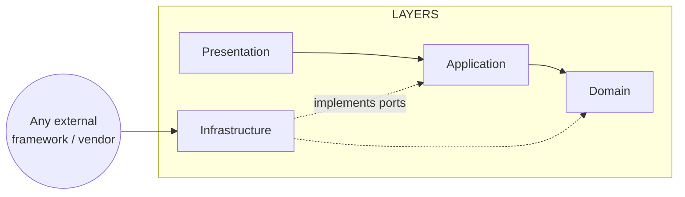

# Tekarai — Dependency Rules

**Status:** Authoritative (Phase 02 — Architecture & ADRs)
**Related ADRs:** ADR-002, ADR-006, ADR-007, ADR-012
**Enforced by:** `backend/tests/architecture/` (mechanical subset) + review
(the rest). Rules A–N originate in `docs/Phases/Phase2.md` §42.

---

## 1. Dependency Diagram

- Outer → inner only. Inner layers never import outer layers or frameworks.
- Infrastructure reaches Domain/Application **only** to implement their
  interfaces.
- Frameworks and vendor SDKs appear only in Infrastructure and Presentation
  framework glue.

## 2. Dependency Matrix (Phase 02 §41)

Compile-time dependencies (import of public contracts only). Runtime event
relationships are listed separately and **never** create import dependencies.

| Module | May depend on (compile-time) | Runtime/event relations | Status |
|---|---|---|---|
| Platform Core | — | — | FIXED |
| Identity | Platform Core | — | FIXED |
| Organization | Identity, Platform Core | identity events | FIXED |
| People / HR | Organization, Identity, Platform Core | org events | FIXED |
| Projects | Organization, Identity, Platform Core | notifies via events | FIXED |
| Tasks | Projects, Identity, Platform Core | events → Notifications/Analytics | FIXED |
| Assets | Organization, Platform Core | events → Maintenance/Analytics | FIXED |
| Devices | Assets, Platform Core | events → Maintenance | FIXED |
| Maintenance | Assets, Devices, Identity, Platform Core | events → Notifications | FIXED |
| Documents | Identity, Organization, Platform Core | document events → Workflow trigger | PARTIAL (Documents↔Workflow contract: TBD in their phases) |
| Workflow | Identity, Platform Core | consumes trigger contracts | FIXED |
| Communication | Identity, Platform Core | events → Notifications; media plane external | FIXED |
| Notifications | Identity, Platform Core | consumes events from all domains | FIXED |
| Analytics | Platform Core (event contracts) | consumes integration events from all | FIXED |
| AI | Platform Core | consumes authorized data via application contracts | FIXED |
| Integration Hub | Platform Core | publishes/consumes integration events | FIXED |
| Performance engine placement (Analytics vs own context) | — | — | **TO BE DECIDED (Phase 03)** |

Any dependency not listed here is forbidden until added to this document via
an ADR/design decision (spec §41: dependencies must not be guessed).

## 3. Layer Import Rules

| From \ may import | own domain | own application | own infrastructure | other module (application only) | django / DRF | vendor SDKs |
|---|---|---|---|---|---|---|
| `apps/<m>/domain` | ✓ | ✗ | ✗ | ✗ | ✗ | ✗ |
| `apps/<m>/application` | ✓ | ✓ | ✗ | ✓ | ✗ (django.core.exceptions allowed) | ✗ |
| `apps/<m>/infrastructure` | ✓ | ✓ | ✓ | ✗ | ✓ | ✓ (adapters only) |
| `apps/<m>/presentation` | ✓ (read-only contracts) | ✓ | ✗ | ✓ | ✓ | ✗ |

Cross-module imports may target **only** the other module's `application`
package (its public contracts) — never `domain` or `infrastructure`
internals (RULE E/F).

## 4. Architectural Rules to Enforce (Phase 02 §42)

| Rule | Statement | Enforcement |
|---|---|---|
| A | Domain cannot depend on Infrastructure | Architecture test (`testArchitecturalRules.py`) |
| B | Domain cannot depend on HTTP | Architecture test |
| C | Domain cannot depend on Django views | Architecture test |
| D | Domain cannot depend on external providers | Architecture test |
| E | Modules cannot access another module's private implementation | Architecture test + review |
| F | Cross-module communication must use explicit contracts | Architecture test + review |
| G | Business logic cannot live in serializers | Review + phase tests (no serializers exist yet) |
| H | Business logic cannot live in views | Review + phase tests |
| I | Secrets cannot exist in source code | Architecture test (`testSettingsSecurity.py`, Phase 01) |
| J | Tenant isolation must be enforced server-side | Design rule (ADR-012); isolation tests from Identity/ERD phases |
| K | Every public API must be versioned | Architecture test (URL scan `/api/vN/`) |
| L | Every important event must have a contract | Event catalogue review (Event Architecture §4) |
| M | Every architectural decision must be documented | ADR process (`docs/adr/`) |
| N | No architecture shortcut without documented justification | Review + Exit Gates |

Rules G, H, J, L become mechanically testable as soon as the corresponding
code exists; their enforcement owners are named above.

## 5. Review Checklist (per pull request)

1. New imports respect §3 (layer import rules).
2. Any new cross-module dependency updates §2 via a design note/ADR.
3. Domain files still import zero framework modules.
4. New endpoints are versioned; new events have named contracts.
5. No secret/credential patterns in source (test I also scans).
