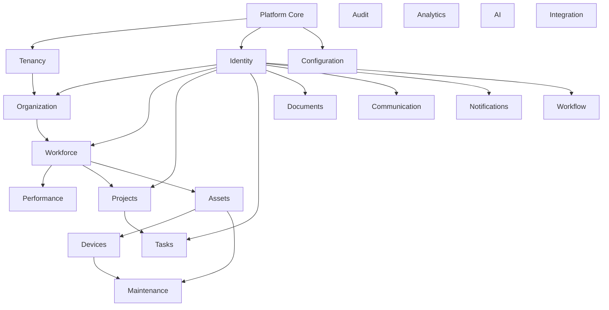

# Tekarai — Domain Dependencies

**Status:** Authoritative (Phase 03 — Domain Architecture)
**Specification:** `docs/Phases/Phase3.md` §5, §22, §25 (extraction path)
**Supersedes:** the coarse Phase 02 dependency matrix (ModuleArchitecture/
DependencyRules) at context granularity — layer rules from Phase 02 remain
binding.

---

## 1. Dependency Rule (spec §5)

- Layer direction: `Presentation → Application → Domain ← Infrastructure`;
  the domain never depends on infrastructure.
- **Between bounded contexts:** a direct dependency `Domain A → Domain B` is
  allowed **only** when it is a genuine architectural contract (public
  application layer import).
- Default pattern: `Domain A → Domain Event → Event Bus → Domain B`.
- Unknown/uncertain dependency ⇒ `STATUS = TO BE DECIDED` + design decision
  (Phase 02 §41 discipline retained).

## 2. Structural Dependency Graph (allowed compile-time)

## 3. Dependency Matrix (context granularity)

| Context | Depends on (contract-level) | Depended on by | Event relations (no import) |
|---|---|---|---|
| Platform Core | — | all | — |
| Tenancy | Platform Core | Organization; (tenant context used by all) | membershipChanged → Identity (sync), Notifications |
| Identity | Platform Core | nearly all (principal resolution) | userRegistered/roleAssigned → Audit, Notifications |
| Configuration | Platform Core | all (reads) | configurationChanged → interested contexts |
| Organization | Tenancy, Identity, Core | Workforce, Projects, Assets, Documents | organizationChanged → Analytics |
| Workforce | Organization, Identity, Core | Performance, Projects | employeeHired/Terminated → Audit, Notifications, Analytics |
| Performance | Workforce, Core | Analytics, AI (consumers) | performanceEvaluationSubmitted/Changed → Audit, Analytics, AI |
| Projects | Organization, Workforce, Identity, Core | Tasks | projectCreated/Closed → Analytics, Notifications |
| Tasks | Projects, Identity, Core | — (consumers are event-based) | taskAssigned/Completed → Notifications, Analytics, Workflow (optional) |
| Assets | Organization, Core | Devices, Maintenance | assetAssigned/Retired → Analytics |
| Devices | Assets, Core | Maintenance | deviceOffline, telemetryReceived → Maintenance, Analytics, AI |
| Maintenance | Assets, Devices, Identity, Core | — | maintenanceRequired, workOrderCompleted → Notifications, Analytics |
| Documents | Identity, Organization, Core | — (Workflow triggered via event) | documentSubmitted → Workflow trigger, AI; documentApproved → Analytics |
| Workflow | Identity, Core | any triggering domain | workflowStarted/Completed → triggering domain, Notifications, Audit |
| Communication | Identity, Core | — | messageCreated, meetingStarted/Ended → Notifications, Analytics, AI |
| Notifications | Identity, Core | — (terminal) | consumes events of all domains |
| Audit | Core | governance/queries | consumes events of all domains (record side) |
| Analytics | Core (event contracts) | AI (optional) | consumes integration events of all domains |
| AI | Core | — (writes back via application commands) | aiResultProduced → Notifications, Analytics |
| Integration | Core | external systems (both directions) | integrationEvents in/out |

### TBD items (STATUS = TO BE DECIDED)

| Question | Decision owner |
|---|---|
| Tasks → Workflow: auto-trigger workflows on task events? | Workflow/Tasks phases |
| Communication ↔ Presence storage split (Redis vs SQL) | Communication phase |
| AI knowledge graph persistence ownership | AI phase (13/16) |
| Analytics consuming directly vs. dedicated event store | Phase 4/19 database architecture |

## 4. Forbidden Dependencies

- Any context → another context's `domain` or `infrastructure` package
  (RULE E/F, Phase 02; spec §21 Rule 01/02/15).
- Any context importing another context's ORM models or touching its tables.
- Cycles of any kind; the graph in §2 is acyclic by construction.
- Domain layers importing frameworks (RULES A–D, Phase 02).

## 5. Cross-Domain Communication Patterns

1. **Contract call** (sync): application layer A → public application
   contract of B (listed in §3 "depends on").
2. **Event** (async, default): A emits domain/integration event → bus →
   handlers in Audit/Notifications/Analytics/AI/Integration.
3. **Query interface** (read-only): A queries B's read-side contract — never
   B's tables.

Worked example (spec §10): Performance submits evaluation →
`performanceEvaluationSubmitted` → bus → { Audit, Notification, Analytics,
AI } — Performance never calls those services directly.

## 6. Microservice Extraction Path (spec §25)

Candidates, triggers, and readiness rules: `DomainArchitecture.md` §14.
Preconditions enforced from now: event-only integration, no cross-context
database access, versioned contracts (RULES 01/03/13, `DomainRules.md`).
