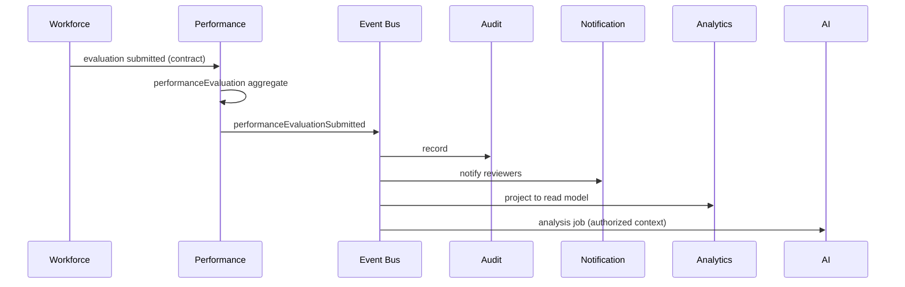

# Tekarai — Domain Events

**Status:** Authoritative (Phase 03 — Domain Architecture)
**Specification:** `docs/Phases/Phase3.md` §9 (rule + envelope), §10 (example)

---

## 1. Rules (spec §9)

- Business events are **explicit** — no implicit side channels.
- Events are **facts** ("assignment happened"), never commands ("please
  assign") — ADR-008.
- **Naming standard:** camelCase facts (`taskAssigned`). PascalCase names in
  spec examples are conceptual; camelCase is the project standard (ADR-001).
- Events are **versionable** (spec §21 Rule 13); breaking payload change ⇒
  new version.

## 2. Event Envelope (mandatory fields, spec §9)

| Field | Meaning |
|---|---|
| eventId | unique event identity (UUID) |
| eventType | camelCase fact name |
| aggregateId | id of the emitting aggregate root |
| tenantId | tenant boundary of the fact |
| occurredAt | when the fact happened (UTC) |
| correlationId | flows through logs, audit, integrations (ADR-016) |
| actorId | who/what caused it (user, service account, connector) |
| version | contract version of the payload |

## 3. Event Catalogue (main events per context)

| Context | Main events |
|---|---|
| Identity | userRegistered, userActivated, userSuspended, credentialChanged, roleAssigned, sessionRevoked |
| Tenancy | tenantCreated, tenantSuspended, membershipGranted, membershipChanged, membershipRevoked |
| Organization | organizationCreated, orgUnitChanged, positionDefined |
| Workforce | employeeHired, employeeTerminated, employmentChanged, leaveRequested, leaveApproved |
| Performance | performanceEvaluationSubmitted, performanceEvaluationChanged, performanceCycleOpened, performanceCycleClosed |
| Projects | projectCreated, projectMemberAdded, projectPhaseCompleted, projectClosed |
| Tasks | taskCreated, taskAssigned, taskCompleted, taskReopened, taskDependencyAdded |
| Assets | assetRegistered, assetAssigned, assetRetired |
| Devices | deviceRegistered, deviceOffline, deviceOnline, telemetryReceived |
| Maintenance | maintenanceRequired, workOrderCreated, workOrderCompleted |
| Documents | documentSubmitted, documentApproved, documentRejected, documentVersionPublished |
| Workflow | workflowStarted, workflowStepApproved, workflowStepRejected, workflowCompleted |
| Communication | messageCreated, meetingStarted, meetingEnded, callStarted, callEnded |
| Notifications | notificationCreated, notificationDelivered, notificationFailed |
| Audit | (audit is the record of events — consumes rather than emits business facts) |
| Analytics | projectionUpdated, analyticsSnapshotReady |
| AI | aiJobRequested, aiResultProduced, aiFeedbackRecorded |
| Integration | integrationEventReceived, integrationEventSent, syncJobCompleted |
| Configuration | configurationChanged, featureFlagToggled |

All 16 events explicitly required by spec §9 are present (userRegistered,
employeeHired, employeeTerminated, projectCreated, taskAssigned,
taskCompleted, performanceEvaluationSubmitted, performanceEvaluationChanged,
documentApproved, workflowStarted, workflowCompleted, assetAssigned,
maintenanceRequired, deviceOffline, meetingStarted, meetingEnded).

## 4. Cross-Domain Flow (spec §10)

Performance never calls notification/audit/AI services directly — every
context stays independent (spec §10).

## 5. Contract Discipline

- Every "important" event ships with a payload contract (RULE L, Phase 02)
  — producer, consumers, fields, version.
- Handlers are idempotent; retries/dead-lettering are infrastructure
  (ADR-008).
- Tenant context and correlationId propagate through every hop.
