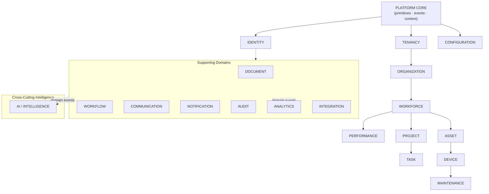

# Tekarai — Domain Map

**Status:** Authoritative (Phase 03 — Domain Architecture)
**Specification:** `docs/Phases/Phase3.md` §3, §22, §27

---

## 1. Domain Map Diagram (spec §22, Mermaid)

Solid arrows: allowed structural dependency (contract-level). Dotted: event /
consumption relations that create **no** import dependency.
(Faithful Mermaid rendering of the spec §22 tree: Platform Core →
Tenancy/Identity/Configuration; Tenancy → Organization → Workforce →
{Performance, Project, Asset}; Project → Task; Asset → Device →
Maintenance; supporting domains + cross-cutting AI.)

## 2. Classification Table (spec §3)

| Context | Class | Justification |
|---|---|---|
| Identity | Generic | every platform has it; zero industry logic |
| Tenancy | Generic | isolation foundation; product-wide |
| Configuration | Generic | runtime settings & flags; product-wide |
| Notification | Generic | commodity capability; providers = extensions |
| Audit | Generic | governance commodity; append-only |
| Integration | Generic (mechanism) / Supporting (connectors) | boundary machinery is generic; connector catalogue grows per customer |
| Platform Core | Generic (foundation) | shared kernel primitives |
| Organization | Core | core operational value of the platform |
| Workforce | Core | core operational value |
| Performance | Core | differentiating evaluation engine |
| Projects | Core | core operations |
| Tasks | Core | core operations |
| Workflow | Core | generic engine used by core operations — classified Core because approvals drive operations |
| AI / Intelligence | Core | explicit product pillar (AI Native, ADR-013) |
| Assets | Supporting | important, not differentiating |
| Devices / OT | Supporting | operational telemetry support |
| Maintenance | Supporting | operational support |
| Documents | Supporting | document management support |
| Communication | Supporting | collaboration support (spec §3 lists it under Supporting) |
| Reporting / Analytics | Supporting | derived value, not transactional truth |

## 3. At-a-Glance Ownership (spec §27)

| Context | Owns (truth) | Main aggregates | Emits (selection) | Depends on | Depended on by |
|---|---|---|---|---|---|
| Platform Core | primitives only | — (no business aggregates) | — | — | all contexts |
| Identity | users, credentials, sessions, roles, permissions, policies | user, session, role | userRegistered, roleAssigned | Platform Core | most contexts |
| Tenancy | tenants, memberships, tenant lifecycle/config | tenant, tenantMembership | tenantCreated, membershipChanged | Platform Core | all tenant-aware contexts |
| Organization | org structure, units, positions | organization, orgUnit, position | organizationCreated, positionDefined | Tenancy, Identity, Core | Workforce, Projects, Assets, Documents |
| Workforce | employees, employment, contracts, attendance, leave, skills | employee, employment, leaveRequest, attendanceRecord | employeeHired, employeeTerminated | Organization, Identity, Core | Performance, Projects |
| Performance | cycles, evaluations, scores, results, history | performanceCycle, performanceEvaluation, kpi | performanceEvaluationSubmitted, performanceEvaluationChanged | Workforce, Core | Analytics, AI (consumers) |
| Projects | projects, members, phases, milestones, budget, risks | project, projectMembership | projectCreated, projectClosed | Organization, Workforce, Identity, Core | Tasks, Analytics |
| Tasks | tasks, subtasks, assignments, dependencies, checklists, comments, activity | task, taskComment, taskActivity | taskAssigned, taskCompleted | Projects, Identity, Core | Notifications, Analytics (consumers) |
| Assets | assets, types, categories, lifecycle, assignments | asset, assetType | assetAssigned, assetRetired | Organization, Core | Devices, Maintenance, Analytics |
| Devices | devices, registrations, health, telemetry, connections | device, telemetryReading | deviceOffline, telemetryReceived | Assets, Core | Maintenance, Analytics, AI |
| Maintenance | plans, schedules, work orders, history | maintenancePlan, workOrder | maintenanceRequired, workOrderCompleted | Assets, Devices, Core | Notifications (consumer) |
| Documents | documents, versions, folders, permissions, relations | document, folder | documentSubmitted, documentApproved | Identity, Organization, Core | Workflow (trigger), AI |
| Workflow | definitions, versions, instances, steps, approvals, transitions | workflowDefinition, workflowInstance | workflowStarted, workflowCompleted | Identity, Core | any triggering domain |
| Communication | conversations, members, messages, presence, calls, meetings | conversation, message, meeting, call | messageCreated, meetingStarted, meetingEnded | Identity, Core | Notifications, Analytics, AI |
| Notifications | notifications, templates, preferences, delivery | notification, notificationPreference, notificationTemplate | notificationDelivered | Identity, Core | — (terminal consumer) |
| Audit | append-only audit events | auditEvent | — (is the record) | Core (correlation primitives) | governance/queries |
| Analytics | report definitions, dashboards, projections | reportDefinition, dashboard, projection | analyticsSnapshotReady | Core (events only) | AI (optional consumer) |
| AI | model registry, prompts, jobs, results, feedback, knowledge | aiJob, promptDefinition, modelConfiguration | aiResultProduced | Core (authorized contracts) | recommendations → application commands |
| Integration | connectors, credentials, webhooks, sync jobs, mappings | connectorConfiguration, integrationEventRecord, syncJob | integrationEventReceived/Sent | Core | external systems ↔ domains |
| Configuration | system/tenant configuration, feature flags, policies | configurationEntry, featureFlag | configurationChanged | Core | all (reads) |

**Data leaving a boundary:** only application contracts (DTOs), integration
events, and ids. **Data that must never leave:** internal entities, ORM
models, private children of aggregates, another context's tables
(`DomainRules.md`).
