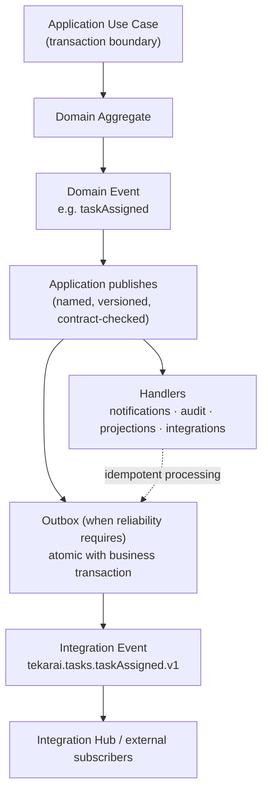

# Tekarai — Event Architecture

**Status:** Authoritative (Phase 02 — Architecture & ADRs)
**Related ADRs:** ADR-008 (foundation), ADR-016 (correlation IDs)
**Concrete transport** (in-process bus, outbox, broker) is selected by the
phases that need it — Phase 02 fixes semantics and contracts only.

---

## 1. Event Taxonomy

| Kind | Meaning | Scope | Example |
|---|---|---|---|
| **Domain Event** | A business fact that happened inside a context | inside the bounded context / application architecture | `taskAssigned` |
| **Application Event** | An orchestration-level occurrence produced by a use case | between contexts in-process | `taskAssignmentCompleted` |
| **Integration Event** | A versioned contract for external systems/modules | across modules/clients/systems | `tekarai.tasks.taskAssigned.v1` |

Commands request actions ("assign this task"); queries never mutate; events
are immutable facts (Master Specification §25; Data Flow §15).

## 2. Event Flow Diagram

## 3. Contract Requirements (Phase 02 §15)

Every event must have:

1. **Name** — camelCase domain fact (`taskAssigned`).
2. **Version** — integration events carry a version suffix (`.v1`).
3. **Producer** — the owning context (single writer principle).
4. **Consumers** — declared consumers (at least the intended category).
5. **Payload contract** — explicit fields, types, tenant context,
   correlation ID; **never coupled to a Django model implementation**.
6. **Auditability** — events are recordable and reconstructable
   (Who/What/When/Where/Why).

## 4. Event Catalogue Discipline (RULE L)

- Each context maintains an event catalogue section in its phase
  specification; "important" events (business state transitions, security
  operations, integrations) cannot ship without a written contract.
- Breaking payload changes require a new version; old versions retire on a
  documented schedule.

## 5. Delivery Semantics

- Handlers are **idempotent** wherever duplicate delivery is possible
  (webhooks, integration events, notification delivery, async commands).
- Retries, backoff and dead-letter handling are infrastructure concerns.
- Events that must not be lost are persisted via the **outbox pattern**
  (atomic with the business transaction — ADR-008).

## 6. Synchronous vs Asynchronous Boundary

See `LayerArchitecture.md` §7. Events decouple: producers never block on
consumers; consumers never reach back into producer internals.
