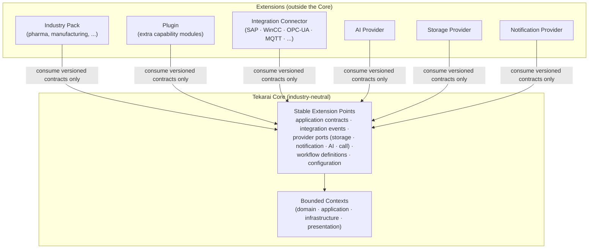

# Tekarai — Extension Architecture

**Status:** Authoritative (Phase 02 — Architecture & ADRs)
**Related ADRs:** ADR-014 (decisive), ADR-005, ADR-015

---

## 1. Extension Architecture Diagram (Phase 02 §29)

## 2. Extension Types

| Type | Purpose | Examples |
|---|---|---|
| Industry Pack | Domain vocabulary + workflows + connectors for one industry | pharmaceutical manufacturing pack |
| Plugin | Additional capability module following Core layer rules | custom reporting widget backend |
| Integration Connector | Protocol adapter to an external system | SAP, WinCC, OPC-UA, MQTT |
| AI Provider | Model provider behind the AI port | local model, cloud model |
| Storage Provider | Binary storage behind the storage port | local, S3-compatible, Azure |
| Notification Provider | Delivery channel behind the notification port | email, SMS, push providers |

## 3. Rules

1. The Core is never modified per customer — variation is configuration or
   extension (ADR-014). "Configuration over Customization" first.
2. Extensions consume **only** stable, versioned extension points; Core
   internals (`domain`, `infrastructure`) are private (RULE E).
3. Extensions inherit all platform invariants: tenant isolation,
   authorization, audit, naming, event contracts.
4. An extension may add contexts/tables it owns; it may not alter
   Core-owned tables.
5. Extension contracts version like public APIs: breaking change ⇒ new
   version + migration note (ADR-005 discipline).
6. Installing an Industry Pack is an explicit, per-deployment/per-tenant
   configuration decision.

## 4. Extension Point Stability Tiers

| Tier | Stability | Change policy |
|---|---|---|
| Application contracts & integration events | Stable | additive changes; breaking ⇒ new version |
| Provider ports (storage/notification/AI/call) | Stable | implementations vary, interfaces rarely |
| Workflow definitions / configuration schema | Evolving | additive, documented per phase |
| Core internals | Private | no external use, refactor freely |

## 5. Review Gate for New Extensions

An extension proposal must state: the need, the extension type, the
extension points consumed, data it owns, events produced/consumed, tenant
and security implications — recorded before implementation (RULE M).
