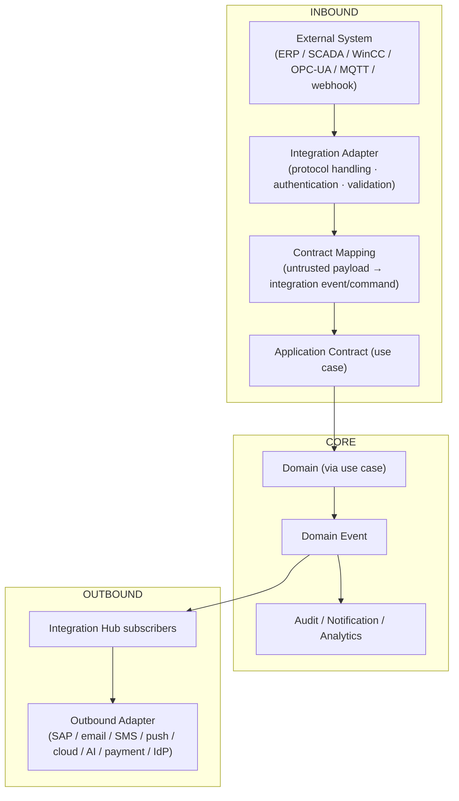

# Tekarai — Integration Architecture

**Status:** Authoritative (Phase 02 — Architecture & ADRs)
**Related ADRs:** ADR-015 (decisive), ADR-008, ADR-014

---

## 1. Integration Flow Diagram (Phase 02 §27)

## 2. Rules

1. Every external system gets an **adapter**; the domain knows the business
   concept, never the vendor protocol (`WinCCAdapter`, `SapAdapter`,
   `OpcUaAdapter`, `MqttAdapter`, `RestAdapter`).
2. Adapters live in the Integration Hub / infrastructure — vendor SDKs are
   forbidden in domain and application layers (RULE D).
3. **Inbound payloads are untrusted:** validation and mapping happen at the
   boundary; external data never becomes a domain object directly.
4. Inbound integrations are **idempotent** (duplicate delivery must not
   create duplicate business state) and **audited**.
5. Outbound integrations subscribe to versioned integration events
   (`tekarai.<context>.<event>.vN`).
6. Each connector requires a **defined contract before implementation**
   (spec: Integration phases; no speculative connectors).

## 3. Planned Integration Categories (contract TBD per connector)

| Category | Examples | Phase |
|---|---|---|
| ERP | SAP | Integration phase |
| Industrial/OT | SCADA, WinCC, OPC-UA, MQTT | Integration phase / Industry Packs |
| Messaging providers | Email, SMS, Push | Notification phases |
| AI providers | OpenAI, local models, others | AI phases (ADR-013) |
| Cloud services | storage, identity providers | per phase |
| Payment | gateways | later decision |

STATUS for every concrete connector: **TO BE DECIDED** until its phase
delivers the contract (spec §41 discipline).

## 4. Webhook / Callback Rules

- Endpoint per connector, versioned, authenticated (signature/secret from
  configuration).
- Payload → integration event mapping table documented per connector.
- Replay protection: idempotency keys + deduplication window.
- Failure handling: retry with backoff → dead-letter + alerting (ADR-016).
