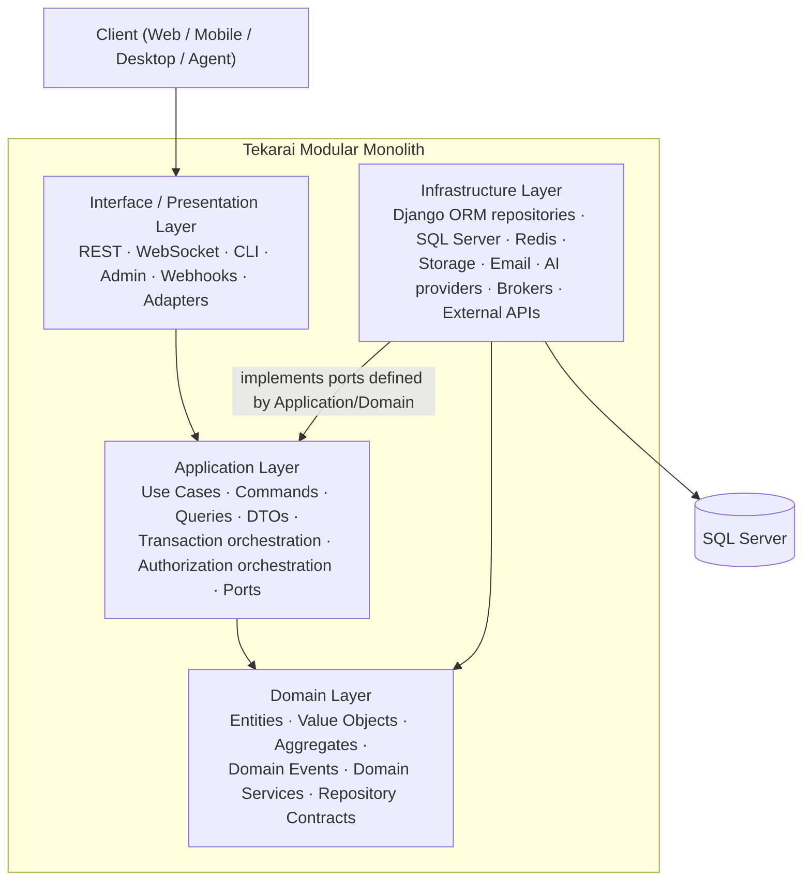
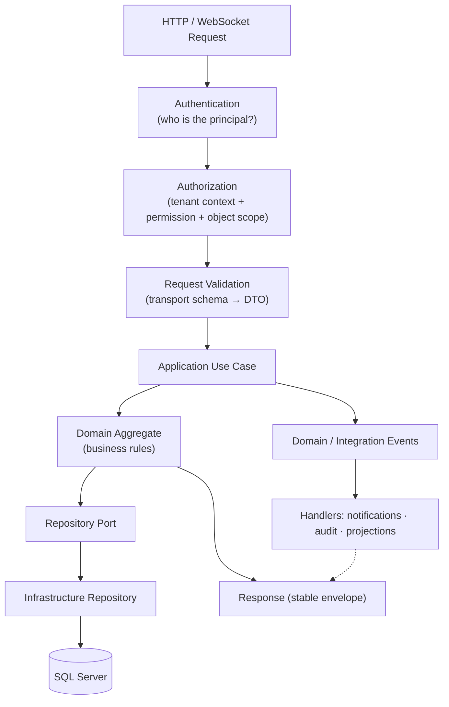

# Tekarai — Layer Architecture

**Status:** Authoritative (Phase 02 — Architecture & ADRs)
**Related ADRs:** ADR-006, ADR-007, ADR-008
**Enforced by:** `backend/tests/architecture/` (RULE A–H subset; see
`DependencyRules.md` §4).

---

## 1. Layer Diagram



Dependencies point **inward**. Infrastructure implements interfaces
(ports) defined by Domain/Application — dependency inversion (ADR-007).

## 2. Layer Responsibilities

### 2.1 Interface / Presentation Layer (Phase 02 §8)
- REST views, WebSocket consumers, CLI, admin, inbound webhooks, external API
  adapters.
- Translates transport ↔ application DTOs. **Contains no business rules.**
- Handles authentication plugs, content negotiation, throttling hooks.

### 2.2 Application Layer (Phase 02 §6)
- Executes **use cases** (`createProject`, `assignTask`, `approveDocument`,
  `startWorkflow`, `startMeeting`), orchestrates domains, owns transaction
  boundaries, orchestrates authorization, calls repository **ports**, publishes
  application/integration events, calls external ports.
- Does **not** own domain business rules; it is use-case oriented.

### 2.3 Domain Layer (Phase 02 §5)
- Entities, value objects, aggregates, domain events, domain services,
  repository contracts — the business rules.
- Must **not** depend on: HTTP, REST framework, Django views/serializers,
  database implementation, Redis, Celery, external APIs (RULE A–D).

### 2.4 Infrastructure Layer (Phase 02 §7)
- Django ORM repository implementations, SQL Server access, Redis, file
  storage, email provider, WebRTC infrastructure, external APIs, AI
  providers, message brokers.
- Implements ports defined by inner layers; owns **no business rules**.

### 2.5 Cross-Cutting Concerns
Security, logging, audit, observability, configuration, events, caching,
messaging, error handling — separate from the layer hierarchy and described
in their own documents (see `SystemArchitecture.md` §5).

## 3. API Request Flow (Phase 02 §17)



Queries follow the same path minus mutation: `Query → read repository →
DTO → response`; **queries never mutate business state**.

## 4. Dependency Rule & Inversion (Phase 02 §9–10)

- Allowed: `Presentation → Application → Domain`; `Infrastructure →
  Application / Domain` (interface realization).
- Forbidden: Domain/Application importing Infrastructure or Presentation;
  Domain importing any framework (RULE A–D).
- Application never touches the ORM directly — it depends on repository
  interfaces (e.g. `UserRepository` port → `DjangoUserRepository`
  implementation).

## 5. Standard Bounded-Context Layout

```
apps/<context>/
├── domain/            entities · valueObjects · aggregates · events ·
│                      services · repositories (contracts) · exceptions
├── application/       commands · queries · useCases · dto · services ·
│                      handlers · ports
├── infrastructure/    models (Django ORM) · repositories (impl) ·
│                      providers · migrations
└── presentation/      api/ (serializers · views · urls · permissions ·
                       schemas) · consumers · webhooks
```

(Folder names are camelCase per ADR-001; enforced by
`tests/architecture/testNamingConventions.py` as contexts appear.)

## 6. Transaction Boundary (Phase 02 §34)

- Transactions are defined **per use case** around business consistency —
  never one giant system-wide transaction, never scattered `save()` calls.
- Boundaries are explicit, testable and documented in the use case.
- Side effects that must not block the transaction (notifications,
  integrations, AI) leave the boundary as events (outbox when reliability
  requires it — ADR-008).

## 7. Synchronous vs Asynchronous (Phase 02 §16)

| Mode | Use for | Examples |
|---|---|---|
| Synchronous | short operations, direct API requests, validation, fast queries | CRUD commands, permission checks, reads |
| Asynchronous | latency or external dependency | notification delivery, file processing, AI processing, heavy reports, event consumers, integration jobs, background processing |

Asynchronous execution is a deliberate choice per use case, never a default.
(Infrastructure for async arrives with the phases that need it.)

## 8. Database Access Rule (Phase 02 §35)

- Domain does not know Django QuerySets.
- Business logic must not spread across `models.py`, `views.py`,
  `serializers.py`.
- A Django model is a **persistence representation** — it is not
  automatically the domain model. Mapping happens in infrastructure
  repositories.
- All SQL access is behind repository implementations.

## 9. Error Handling Contract

- Errors map to **stable API error envelopes** (error code, message,
  correlation ID) — never stack traces or database internals in production.
- Failure classes: validation · authorization · business rule ·
  infrastructure · external integration (Data Flow Documentation §16).

## 10. Django Usage Rule (Phase 02 §36)

Django is the framework, not the architecture. Where business architecture
and framework convenience conflict, **business architecture wins**
(ADR-001/007).
