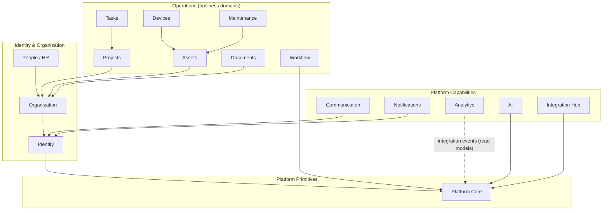
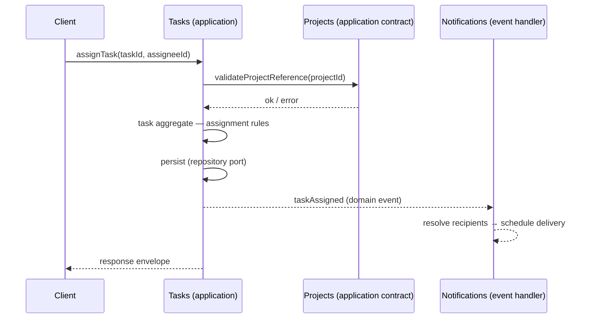

# Tekarai — Module Architecture

**Status:** Authoritative (Phase 02 — Architecture & ADRs)
**Related ADRs:** ADR-002, ADR-006, ADR-012
**Note:** Phase 02 defines module **boundaries only** — no models or
implementation (spec §11/§45). Phase 03 refines this map into 20 bounded
contexts (adding Tenancy, Audit, Reporting/Configuration as explicit
contexts; see `docs/Phases/Phase3.md`).

---

## 1. Module Boundary Diagram

Solid arrows are allowed **compile-time** dependencies (import of public
contracts). Dotted arrows are **runtime/event** relationships that do not
create import dependencies.

## 2. Module Boundary Rules (Phase 02 §12–14)

Every module must have: a defined responsibility, a public internal API,
declared dependencies, its own domain model, application services,
infrastructure adapters and event contracts.

Forbidden:
- Direct access to another module's database tables or internal models
  (RULE E).
- Cross-module communication outside explicit contracts: application
  services, domain interfaces, application/domain events, query interfaces,
  integration contracts (RULE F).
- Copying another domain's business logic.

## 3. Architecture Matrix (Phase 02 §40)

Legend — **Owns Data**: data the module exclusively owns/writes.
**Consumes/Produces**: primary events & contracts (indicative; exact contracts
are fixed by the owning phase). **Depends On**: compile-time contract
dependencies. **Exposes**: public application contracts/API surface.

| Module | Responsibility | Owns Data | Consumes | Produces | Depends On | Exposes |
|---|---|---|---|---|---|---|
| **Platform Core** | Cross-cutting primitives: UUID identity, base entity, lifecycle, soft delete, tenant ownership primitives, exceptions, result contracts, event abstractions | Base/abstract definitions only (no business tables) | — | domain event abstractions | — | base contracts, repository contracts, event bus port |
| **Identity** | Users, credentials, sessions, factors, roles, permissions, policies, tokens, identity lifecycle | users, credentials, sessions, roles, permissions, policies | — | userCreated, roleAssigned, sessionRevoked | Platform Core | identity queries/commands, principal contract |
| **Organization** | Tenants, organizations, units, departments, locations, hierarchy | tenants, organizations, units, departments, locations | identity events (membership) | tenantCreated, orgUnitChanged | Identity, Platform Core | org structure queries, tenant contract |
| **People / HR** | Employee profiles, employment lifecycle, positions, job titles, reporting, skills, competencies | employees, positions, employments, skills | org structure | employeeOnboarded, employeeOffboarded | Organization, Identity, Platform Core | employee queries, assignment contracts |
| **Projects** | Projects, membership, lifecycle, phases, objectives, metadata | projects, projectMembers, phases, objectives | org + employee contracts | projectCreated, projectClosed | Organization, Identity, Platform Core | project contracts, membership queries |
| **Tasks** | Tasks, status, priority, assignment, dependencies, checklists, comments, history, relations | tasks, assignments, dependencies, checklists, comments | project contract (reference only) | taskCreated, taskAssigned, taskCompleted | Projects, Identity, Platform Core | task contracts, personal/worklist queries |
| **Assets** | Enterprise asset lifecycle | assets, asset lifecycle records | org contracts | assetRegistered, assetRetired | Organization, Platform Core | asset contracts, asset queries |
| **Devices** | Technical devices and machine metadata | devices, device metadata | asset contract | deviceRegistered, deviceStatusChanged | Assets, Platform Core | device contracts |
| **Maintenance** | Maintenance plans, schedules, work orders, incidents, service history | plans, schedules, workOrders, incidents, history | asset/device contracts | workOrderCreated, workOrderCompleted | Assets, Devices, Identity, Platform Core | work order contracts |
| **Documents** | Document metadata, versions, lifecycle, classification, permissions, relations | documents, versions, classifications, permissions | — (workflow via events/contract) | documentSubmitted, documentApproved | Identity, Organization, Platform Core | document contracts, storage-backed content port |
| **Workflow** | Generic workflow definitions, versions, instances, steps, transitions, approvals, delegation, escalation | workflowDefs, versions, instances, transitions, approvals | trigger contracts from any domain | workflowStarted, stepApproved, workflowCompleted | Identity, Platform Core | generic workflow engine contracts |
| **Communication** | Chat (direct/group/channels), official letters, presence, calls, meetings, recording, transcription, AI summary | conversations, members, messages, calls, meetings | identity + org contracts | messageCreated, meetingStarted (integration events) | Identity, Platform Core | messaging/meeting contracts, WebSocket signalling |
| **Notifications** | In-app/email/push notification requests, preferences, templates, delivery status | notifications, recipients, preferences, templates, delivery attempts | business events from all domains | notificationDelivered | Identity, Platform Core | notification contracts, preference API |
| **Analytics** | Read models, reporting projections, dashboards, performance engine inputs | read models, projections, snapshots | integration events from all domains | analytics snapshots | Platform Core (events) | reporting/dashboard queries |
| **AI** | AI capabilities: analysis, summarization, extraction, generation, prediction, knowledge | aiRequests, prompts (versioned), results, governance records | authorized data via application contracts | aiResultProduced | Platform Core | AI capability ports (ADR-013) |
| **Integration Hub** | Adapters for external systems: REST, webhooks, MQTT, OPC-UA, WinCC, SAP | adapter configs, inbound/outbound message logs | integration events; external payloads | integrationEvents (outbound) | Platform Core | connector contracts (ADR-015) |

**TBD items (STATUS = TO BE DECIDED, resolved by the owning phase):**
- Documents ↔ Workflow: direct application contract vs pure event triggering —
  decided in the Documents/Workflow phases.
- Tasks → Notifications / Analytics: event-only (no compile-time dependency) —
  confirmed pattern, exact contracts in those phases.
- Performance evaluation engine: owned by Analytics or its own context —
  Phase 03 decision.

## 4. Domain Boundary Rule (Phase 02 §13)

Each domain owns its data and business rules (Employee rules in People,
Project rules in Projects, Task rules in Tasks, Document rules in Documents,
Communication rules in Communication). Domains never copy each other's
business logic; they consume contracts and events.

## 5. Cross-Domain Communication (Phase 02 §14)

Allowed: application service · domain interface · application event ·
domain event · query interface · integration contract.
Forbidden: uncontrolled direct access to another domain's internal model.

Worked example (Task assigned):

Tasks never touches Projects' internals — only its public contract.
