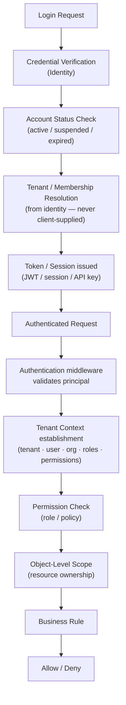

# Tekarai — Security Architecture

**Status:** Authoritative (Phase 02 — Architecture & ADRs)
**Related ADRs:** ADR-010, ADR-012
**Scope:** architecture only — full implementation lands with the Identity
phase (Phase 7) and later hardening phases (spec §19).

---

## 1. Security is a Cross-Cutting Concern

Security is not a module; it is a property of every layer. Each request
passes the same security pipeline regardless of feature.

## 2. Security Layers (Phase 02 §19)

| Layer | Responsibility | Realized in |
|---|---|---|
| Authentication | Prove who the principal is (credentials, JWT, API keys, service accounts) | Identity phase (Phase 7) |
| Authorization | Decide what the principal may do (permissions, roles, policies, object scope) | Identity phase + every use case |
| Tenant Isolation | Ensure tenant A never sees tenant B (ADR-012) | Application + persistence from first business phase |
| Permission Management | Define/assign/audit permissions and roles | Identity phase |
| Secrets Management | Environment/secret-manager only; never in source | Phase 01 (ADR-009/010) — active |
| Input Validation | Transport schema validation at the boundary; domain invariants inside | every phase |
| Rate Limiting | Protect API surface from abuse | API/GUI phases |
| Audit Logging | Security-sensitive operations recorded (Who/What/When/Where/Why) | Audit phase + interim logging |
| Security Monitoring | Detect anomalies; export security events | Observability (ADR-016) + operations |

## 3. Authentication & Authorization Flow

Authentication proves identity; authorization decides permission — always
server-side (RULE J; Data Flow Documentation §4–6).

## 4. Defense-in-Depth Table

| Boundary | Control |
|---|---|
| Transport | HTTPS enforced in production (redirect + HSTS, Phase 01 settings) |
| API | Versioned endpoints, validation, stable error envelopes, rate limiting |
| Application | Use-case authorization orchestration; tenant context mandatory |
| Domain | Business invariants independent of caller |
| Persistence | Tenant-scoped repositories; parameterized SQL only (ORM) |
| Configuration | Fail-closed production; known dev secrets rejected (Phase 01, tested) |
| Audit | Append-oriented security event records with correlation IDs |

## 5. Rules Already Active (Phase 01)

- No secrets in source (architecture tests scan settings + `.env.example`).
- Production fail-closed: `SECRET_KEY`/`ALLOWED_HOSTS`/CSRF/CORS mandatory.
- Security headers and cookie flags set in base settings; HSTS/SSL/secure
  cookies in production.
- Health endpoints leak no credentials (tested).

## 6. Deferred With Explicit Owners

| Topic | Owner phase |
|---|---|
| JWT/token architecture, MFA, sessions | Identity (Phase 7) |
| Object-level permission machinery | Identity + each domain phase |
| Rate limiting infrastructure | API phase |
| Security test matrix | Identity phase |
| Communication security (WS auth, E2E considerations) | Communication phases |
| Final hardening review | Security Hardening phase |
