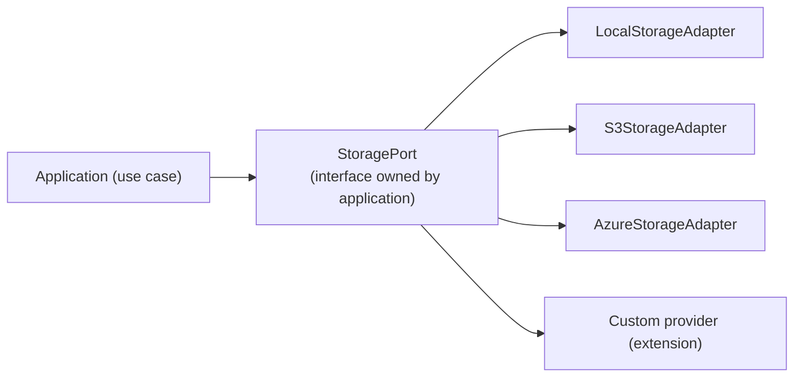

# Tekarai — Storage & Cache Architecture

**Status:** Authoritative (Phase 02 — Architecture & ADRs)
**Related ADRs:** ADR-017 (cloud-ready), ADR-014 (providers as extensions)
**Concrete implementation** arrives with the Documents phase (binary storage)
and Notification/Communication phases (cache/Redis).

---

## 1. Storage Architecture (Phase 02 §25)

Rules:

1. The application never touches the local file system directly — binary
   storage is abstracted behind a **StoragePort**.
2. Database records (metadata, ownership, permissions) and binary objects
   stay decoupled; a storage object never becomes a business record by
   itself.
3. Provider details (bucket names, credentials, endpoints) come from
   configuration (ADR-009) — switching providers is deployment
   configuration, not code change.
4. Storage providers follow the extension rules (ADR-014).
5. Documents own the metadata model; the storage port carries content.

## 2. Cache Architecture (Phase 02 §26)

Cache is an **infrastructure concern**:

| Property | Rule |
|---|---|
| Optional | features must work with cache disabled |
| Replaceable | Redis today's candidate; behind a cache port, never direct API usage in business logic |
| Observable | hit/miss metrics at the port boundary |
| Invalidatable | explicit invalidation strategy per use case; tenant-aware keys |

- Business logic never depends on the Redis API (RULE D); it depends on a
  cache abstraction or application service.
- **Redis is never the source of truth** — SQL Server is (ADR-004); Redis
  serves presence, channel layer, locks, rate limits and caches per the
  Communication/Notification phases.
- Cache keys include tenant context where data is tenant-scoped
  (MultiTenancy §4).
