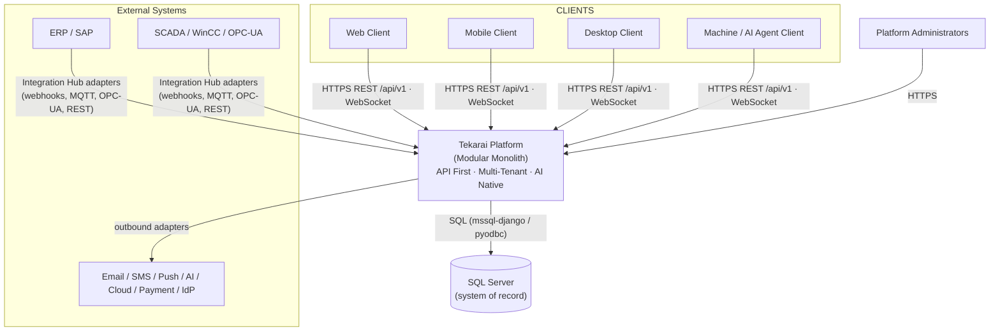
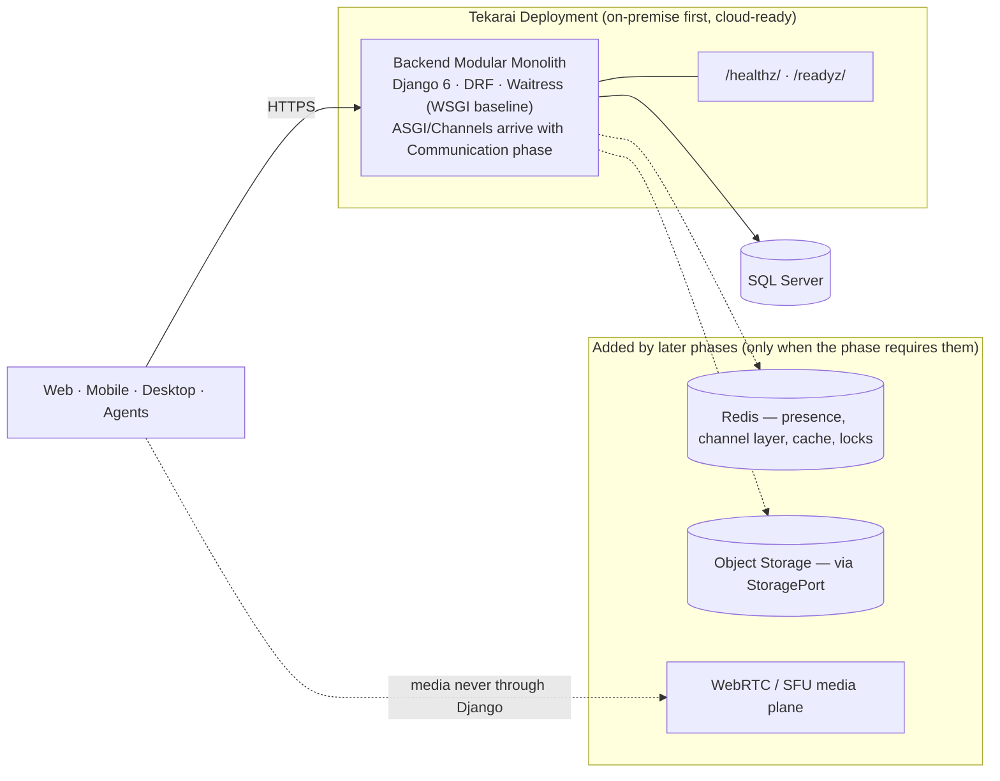

# Tekarai — System Architecture

**Status:** Authoritative (Phase 02 — Architecture & ADRs)
**Related ADRs:** ADR-001, ADR-002, ADR-005, ADR-009, ADR-017, ADR-018
**Scope:** whole platform. Layer detail: `LayerArchitecture.md` · module detail:
`ModuleArchitecture.md` · rules: `DependencyRules.md`.

---

## 1. What Tekarai Is

Tekarai is a general-purpose, multi-tenant **Enterprise Operations Platform**:
identity, organization, workforce, projects, tasks, assets, devices,
maintenance, documents, workflow, communication, notifications, analytics,
AI, integration, audit and configuration — served to web, mobile, desktop,
machine/agent clients and external systems through versioned APIs and events.

It is **not** an industry application. Industry behaviour arrives as Industry
Packs / extensions / connectors (ADR-014).

## 2. System Context Diagram

## 3. Container Diagram

Key rule: **media never flows through Django** — the backend owns signalling
and business state only (Communication phase).

## 4. Architectural Principles (Phase 02 §3)

| # | Principle | Meaning in practice |
|---|---|---|
| 01 | Platform First | Product platform before any customer feature |
| 02 | API First | Every capability is a versioned contract (ADR-005) |
| 03 | Domain Driven Design | Bounded contexts own rules and data (ADR-006) |
| 04 | Clean Architecture | Dependencies point inward (ADR-007) |
| 05 | SOLID | Especially dependency inversion at every port |
| 06 | Event Driven | Facts (events) vs requests (commands) (ADR-008) |
| 07 | Security First | Cross-cutting, fail-closed (ADR-010) |
| 08 | AI Native | AI as platform capability behind ports (ADR-013) |
| 09 | Cloud Ready | Stateless tier, externalized config (ADR-017) |
| 10 | Offline Ready | UUIDs, idempotency, versioned writes (ADR-018) |
| 11 | Configuration over Customization | Variation via config before code (ADR-014) |
| 12 | Documentation Driven Development | Specs and ADRs precede code |
| 13 | Everything is Auditable | Who/What/When/Where/Why/Before/After |
| 14 | Everything is Extensible | Stable extension points (ADR-014) |
| 15 | Explicit over Implicit | No hidden global state or magic |
| 16 | Separation of Concerns | Layers and cross-cutting concerns are distinct |
| 17 | Dependency Inversion | Inner layers define ports; infrastructure implements |
| 18 | Backward Compatibility | Breaking change ⇒ new version, documented |
| 19 | Observability by Design | Logging, metrics, tracing, correlation IDs (ADR-016) |
| 20 | Testability by Design | Rules live where they can be tested in isolation |

## 5. Cross-Cutting Concerns

| Concern | Home | Notes |
|---|---|---|
| Security | `SecurityArchitecture.md` | Authentication, authorization, tenant isolation, secrets, rate limiting |
| Logging / Metrics / Tracing | `ObservabilityArchitecture.md` | Correlation IDs; JSON logs in production |
| Audit | `ObservabilityArchitecture.md` §5 | Business-grade append-only records |
| Configuration | ADR-009 + `config/environment.py` | Explicit, validated, typed; `.env` per environment |
| Events | `EventArchitecture.md` | Domain vs application vs integration events |
| Caching | `StorageArchitecture.md` §2 | Optional, replaceable, invalidatable |
| Error handling | `LayerArchitecture.md` §9 | Stable error envelopes; no stack traces to clients |

## 6. Client Architecture (Phase 02 §31)

- Supported clients: **Web · Mobile · Desktop · Agent (machine) · External API
  clients**. All consume the same versioned REST/WebSocket contracts and
  integration events — the backend is UI-agnostic.
- No client-specific branches inside the backend; client variation is a
  client-side concern plus documented API capabilities.
- Agent clients authenticate as principals with scoped credentials
  (service accounts / API keys — Identity phase).
- Offline capability: clients may cache data, queue commands locally and
  replay them as idempotent commands (ADR-018).

## 7. Communication Platform Boundary (Phase 02 §32)

The macro-architecture reserves the Communication capability from day one:
direct chat, group chat, channels, official letters, voice/video calls,
meetings, screen sharing, presence, recording, transcription, AI summary.
Candidate technology (decided in the Communication phases): Django Channels,
WebSocket, Redis, WebRTC (+ SFU scale path). **Phase 02 defines only the
boundary and responsibilities** — no implementation.

## 8. Offline Strategy (Phase 02 §30)

Architecture permits offline-capable clients via: UUID identifiers, resource
version fields for optimistic concurrency, idempotent command contracts, and
client-owned local queues with domain-specific conflict resolution
(ADR-018). Detailed per-client sync protocols arrive with the GUI/client
phases.

## 9. Configuration Architecture (Phase 02 §24)

Configuration is code-separated, environment-driven and validated
(ADR-009; implemented in Phase 01: `config/settings/*` + `.env.example`).
It is Explicit, Validated and Typed; staging joins when the deployment phase
defines it. Secrets never live in source (enforced by architecture tests).

## 10. Deployment Shape

- Baseline: Windows + Waitress + SQL Server (ADR-003/004).
- Cloud-ready constraints: stateless tier, storage port, externalized
  configuration, health endpoints for probes (ADR-017).
- Containers/rollout/rollback are delivered by the Deployment phase.
