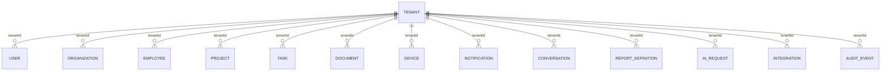

# 01 — Enterprise ERD & Cross-Cutting Database Rules

**Status:** DESIGN (Phase 04) · **Engine:** SQL Server · **ORM:** Django + mssql-django (ADR-004)
**Spec:** `docs/Phases/Phase4.md` §1–§9, §27–§28, §36–§49

---

## 1. Database Philosophy (spec §1–2)

Enterprise-grade · multi-tenant · audit-friendly · secure · scalable ·
extensible · long-term maintainable · optimized for SQL Server · aligned with
the Domain Architecture (Phase 03) and Clean Architecture.

**The database is NOT a business-logic home.** Business rules live in
domain/application layers. The database owns: persistence, integrity,
referential integrity, uniqueness, indexing, transactional consistency,
data constraints.

Standard SQL Server features only; every engine-specific dependency must be
documented (spec §2). Current engine-specific decisions: none beyond the
mssql-django adapter itself (tracked in `07ConstraintCatalog.md` §5).

## 2. Tenant Spine (enterprise view)

Every tenant-owned table hangs off the tenant; cross-domain references are
ids, never cross-schema ownership (spec §6, §7):

Per-domain diagrams: `02DomainERD.md`. Full FK list with cardinality and
delete behavior: `05RelationshipCatalog.md`.

## 3. Primary Key Strategy (spec §3)

- **UUID primary keys for all main entities** — `id UUID PRIMARY KEY`.
- Integer auto-increment is forbidden for main entities (exception:
  purely-internal join optimization tables if ever proven necessary —
  requires an ADR).
- Rationale: distributed systems, multi-tenancy, security (no sequence
  leakage), offline support, synchronization, external integrations.
- Business identifiers (`code`, `employeeNumber`) are **separate columns**
  with tenant-aware unique constraints — never the PK.

## 4. Base Entity (spec §4)

All auditable entities share the base structure (abstract — no table):

| Field | Meaning |
|---|---|
| id | UUID primary key |
| createdAt | creation instant (UTC) |
| updatedAt | last modification instant (UTC) |
| createdBy | user id that created the entity |
| updatedBy | user id of last modification |
| deletedAt | soft-delete instant (NULL = alive) |
| deletedBy | user id that soft-deleted |
| isActive | active flag |

Append-only streams (AuditEvent, telemetry, history tables) use a reduced
base (id, createdAt, createdBy/correlationId) — immutability rules in
`09AuditModel.md`.

## 5. Soft Delete (spec §5)

- Default deletion = **soft delete**: `deletedAt != NULL AND isActive = false`.
- Soft-deleted rows are invisible to normal queries (repository default
  filter) but preserved for audit, compliance, recovery, reporting,
  investigation.
- **Hard delete only via explicit per-entity policy** (documented in
  `04EntityCatalog.md` Delete Policy column + `10DataRetentionPolicy.md`).

## 6. Cross-Cutting Field Rules

| Topic | Rule (spec) |
|---|---|
| Money (§38) | `Decimal` amount + `currency` code — float forbidden |
| Time (§39) | all timestamps timezone-aware; stored UTC; displayed in user/tenant timezone |
| File storage (§40) | binary content in object storage via StoragePort; database keeps metadata + storage reference only |
| JSON (§41) | JSON columns only for metadata, provider-specific configuration, extension data, dynamic configuration — never a replacement for designed schema; core business data stays structured |
| Custom fields (§42) | `CustomFieldDefinition`/`CustomFieldValue` architecture for extensibility; must not replace proper domain modelling |
| Status model (§37) | statuses are enums / reference entities / controlled vocabularies — never free strings on sensitive entities |
| Temporal data (§36) | history-carrying facts use period rows (`startDate`/`endDate` — e.g. EmployeeAssignment), not only current state |

## 7. Relationship & Delete Rules (spec §29–31)

- Every FK declares: owner, dependent, cardinality, delete behavior, tenant
  scope (catalog: `05RelationshipCatalog.md`).
- **CASCADE forbidden by default**; allowed only for children meaningless
  without the parent (versioned children, e.g. DocumentVersion? — no: even
  there soft delete governs; CASCADE is reserved for genuinely owned child
  rows like checklist items, and every use is listed and justified in
  `05RelationshipCatalog.md`).
- Allowed behaviors: PROTECT · RESTRICT · SET_NULL · CASCADE (justified).
- Audit columns (`createdBy/updatedBy/deletedBy`) → User with **SET_NULL**
  so user deletion never destroys audit (spec §35).

### Many-to-Many (spec §30)

Blind `ManyToMany` is forbidden. If the relationship carries information, an
**intermediate entity** is created (e.g. `ProjectMember` instead of
`Project.users`, carrying role/joinedAt/leftAt/isActive). All M↔N
resolutions are listed in `05RelationshipCatalog.md` §3.

## 8. Uniqueness & Indexing (summary — details in 06/07)

- Uniqueness enforced **in the database**, tenant-aware:
  `UNIQUE(tenantId, code)` — not `UNIQUE(code)` (spec §32).
- Indexes follow query patterns (spec §33–34): standard composites
  `(tenantId, status)`, `(tenantId, createdAt)`, `(tenantId, isActive)`;
  every index has a stated justification; no blind indexing.

## 9. Normalization & Transactions (spec §45–46)

- Transactional store mostly **normalized**; denormalization only for
  performance with documentation per field.
- Transaction boundaries defined in application services per use case (e.g.
  createProject → Project + ProjectMember + AuditEvent atomically); aligned
  with aggregate boundaries (Phase 03 §16).

## 10. Concurrency (spec §47)

Sensitive entities get explicit concurrency control: optimistic locking via
`version` column (preferred, offline-friendly — ADR-018), row version
(SQL Server `rowversion` where justified — engine-specific, documented),
transaction isolation where required. Per-entity choice:
`04EntityCatalog.md` Notes column.

## 11. Data Retention & Security (spec §48–49)

- Retention class per domain: `10DataRetentionPolicy.md` (audit long-term,
  transient notifications short-term, telemetry configurable, documents
  long-term).
- Database security: least privilege (app user is not DBA), secure
  credentials from environment (ADR-009), encrypted connections (ODBC
  encrypt=true, Phase 01), no hard-coded passwords, restricted access,
  auditing enabled.

## 12. Industry Extensions (spec §27–28)

Core schema is industry-agnostic. Pharma/Manufacturing/Construction/Oil&
Gas/Healthcare/Retail packs extend via extension points (ADR-014).
**WinCC entities (WinCCConnection…WinCCSyncJob) belong to an Industry Pack
schema, never Core** (spec §28; catalog marks them EXTENSION).

## 13. What This Design Enables (spec §54)

From this set, without redesigning the database architecture: SQL Server
schema → Django models → migrations → API design → repositories/selectors →
application services → events → audit implementation → multi-tenancy →
permission architecture.
