# 02 — Domain ER Diagrams

**Status:** DESIGN (Phase 04) · Mermaid `erDiagram` (version-control friendly)
**Spec:** `docs/Phases/Phase4.md` §9–28
Ownership = Phase 03 contexts (mapping in `README.md`). Base fields
(id/createdAt/updatedAt/createdBy/updatedBy/deletedAt/deletedBy/isActive)
are implicit on `«base»` entities and omitted below for readability —
full lists: `03DatabaseDictionary.md` · `04EntityCatalog.md`.

---

## 1. Platform Core · Tenancy · Configuration (spec §9)

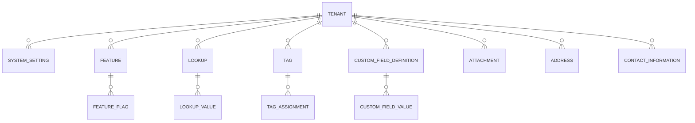

Notes: Tenant/Configuration settings are scoped (system/tenant). Address and
ContactInformation are shared re-usable records referenced by other domains
(polymorphic owner id + owner type).

## 2. Identity (spec §10)

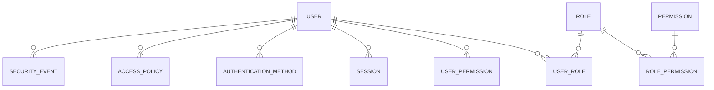

User ≠ Employee (spec §10): Employee lives in Workforce. Credentials are
hashed/protected (never stored raw).

## 3. Organization (spec §11)

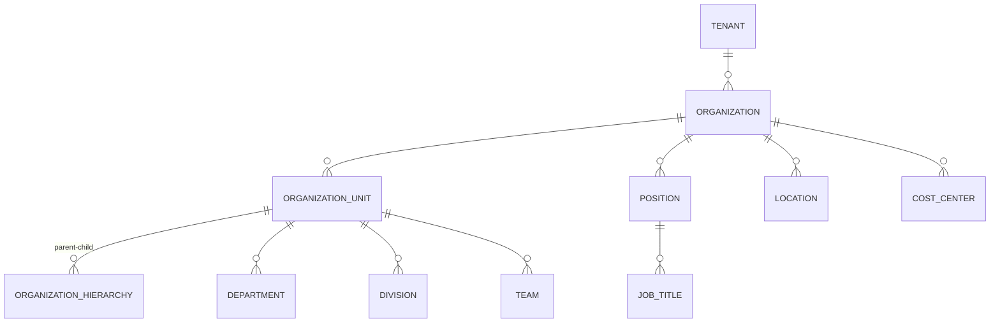

Hierarchy is generic (OrganizationUnit tree with typed nodes) — supports
complex enterprise structures, not only Company→Department (spec §11).

## 4. Workforce / HR + Performance (spec §12)

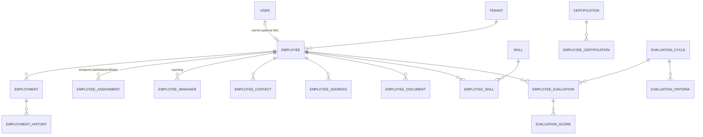

Evaluation entities (EmployeeEvaluation/EvaluationCycle/EvaluationCriteria/
EvaluationScore) are owned by the **Performance** context (Phase 03
resolution); shown here together because spec §12 lists them under HR.
All important HR changes audited (spec §12).

## 5. Project (spec §13)

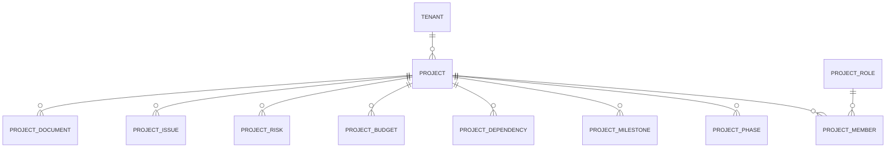

Project is independent of Task implementation (spec §13) — Tasks reference
projects by id.

## 6. Task (spec §14)

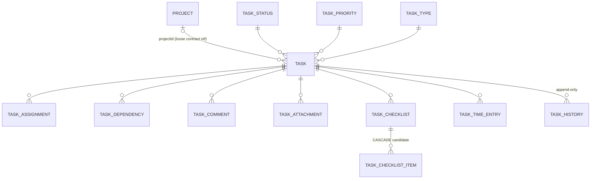

## 7. Asset (spec §15)

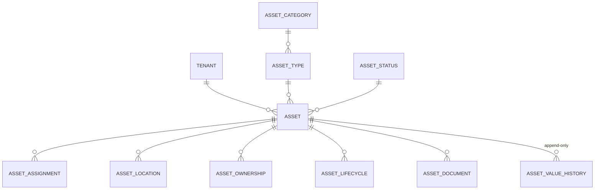

Assets may be physical/digital/financial/operational (spec §15).

## 8. Device / OT + Agent (spec §16)

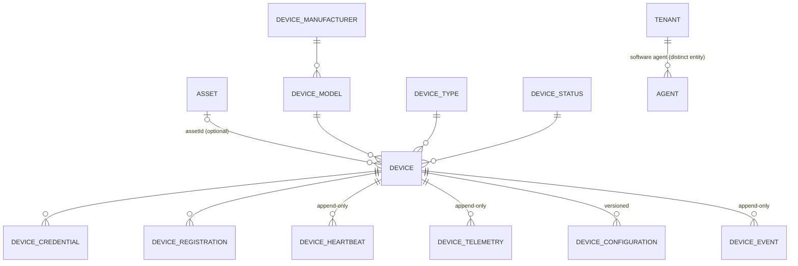

Device (physical/logical) ≠ Agent (software agent) — never merged (spec §16).

## 9. Maintenance (spec §17)

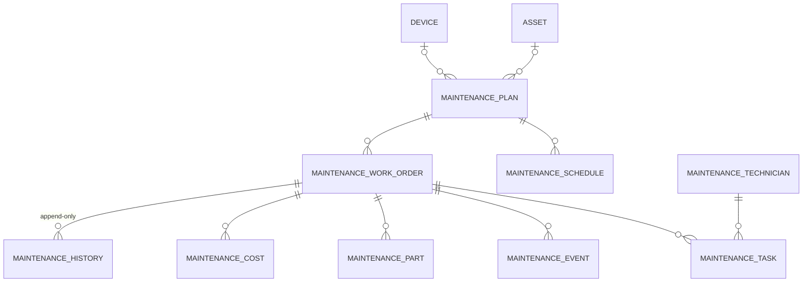

Maintenance serves both Assets and Devices (spec §17).

## 10. Document (spec §18)

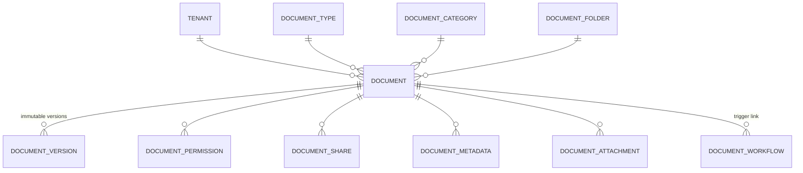

Versions never overwrite (spec §18); binary content lives in object storage
(§40).

## 11. Workflow (spec §19)

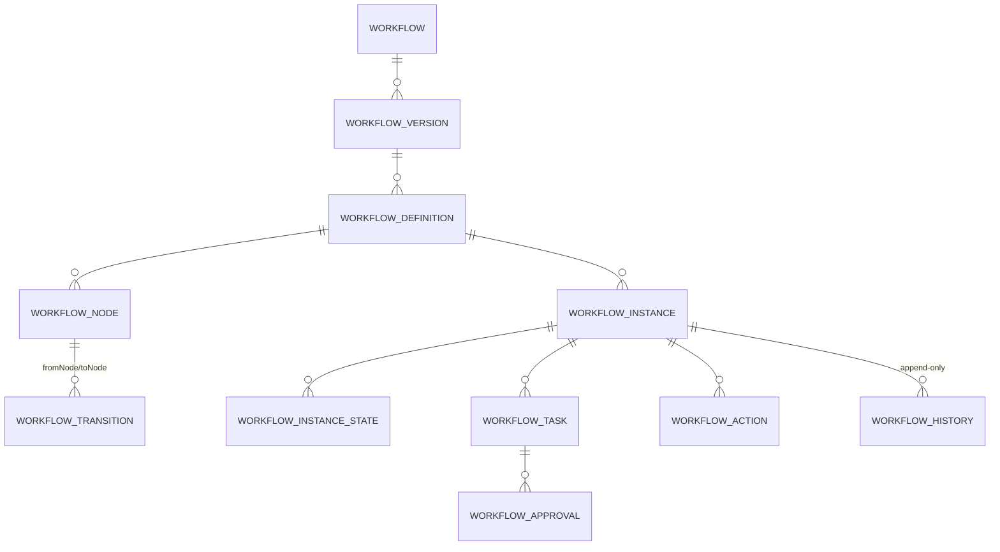

Generic engine — document/project/purchase/leave/maintenance approvals all
use the same entities (spec §19).

## 12. Communication (spec §20)

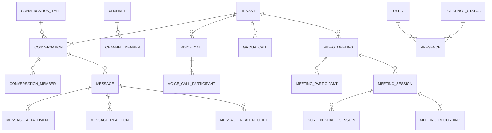

Four layers stay separate (spec §20): WebRTC media · Channels realtime ·
Redis infra · database persistent state.

## 13. Notification (spec §21)

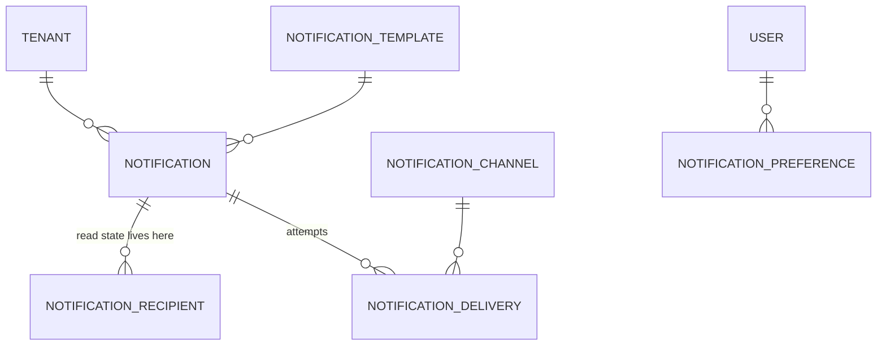

Event-driven creation; channels: in-app/email/SMS/push/realtime (spec §21).
Read-state on recipient (multi-recipient rule).

## 14. Audit (spec §22)

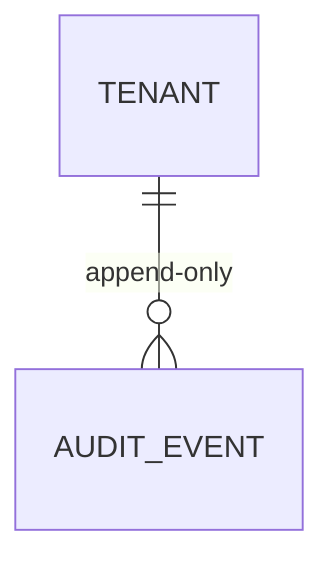

Single append-only table with actor/action/entity/before/after/correlation
detail — `09AuditModel.md`.

## 15. Reporting (spec §23)

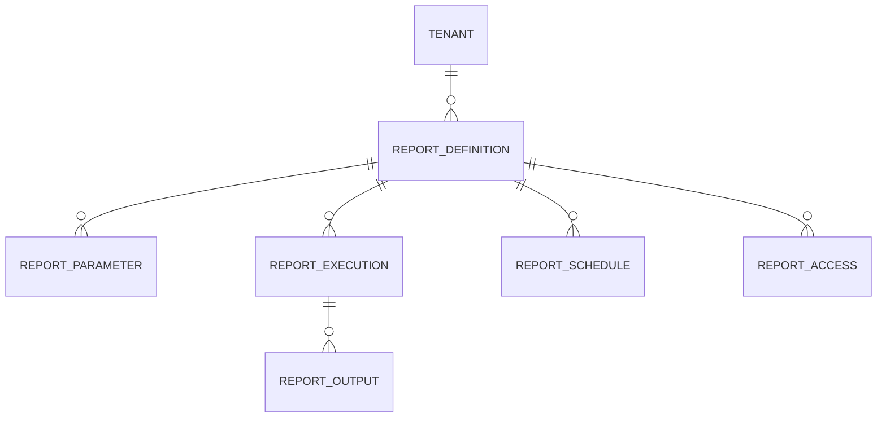

Reporting consumes domain data; domains never depend on reporting (spec §23).

## 16. Analytics (spec §24)

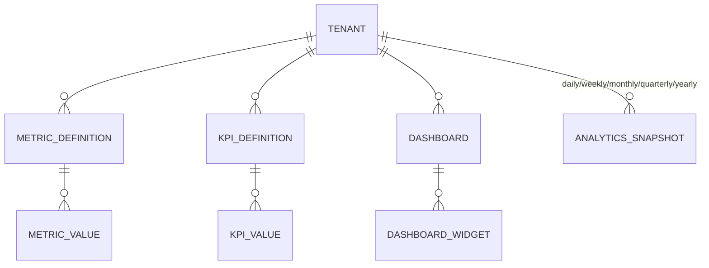

## 17. AI (spec §25)

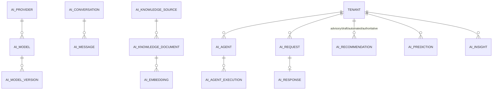

AI never mutates other domains' tables directly (spec §25; ADR-013).

## 18. Integration (spec §26)

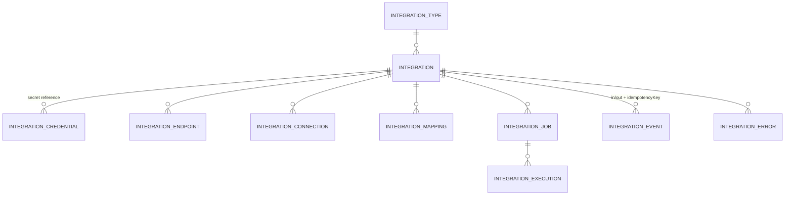

## 19. WinCC / Industrial (spec §28 — INDUSTRY EXTENSION, not Core)

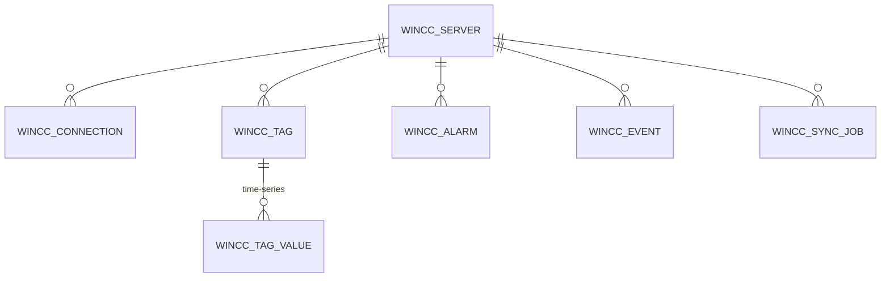

**Marked EXTENSION** — these tables live in an Industry Pack schema
(ADR-014), never in Core.
