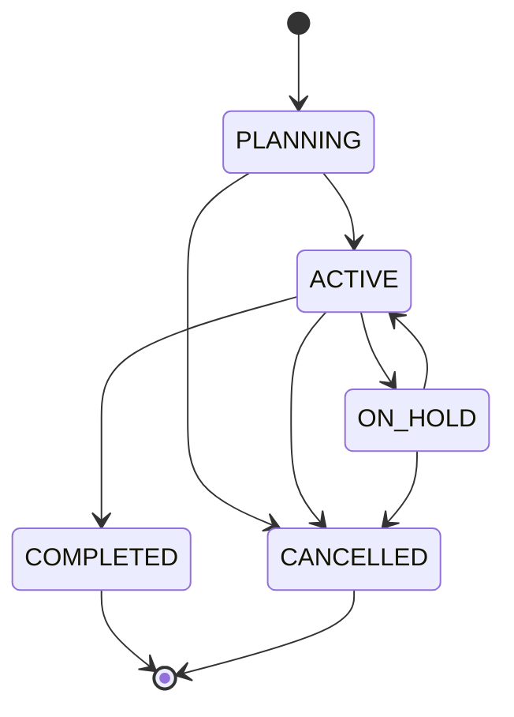
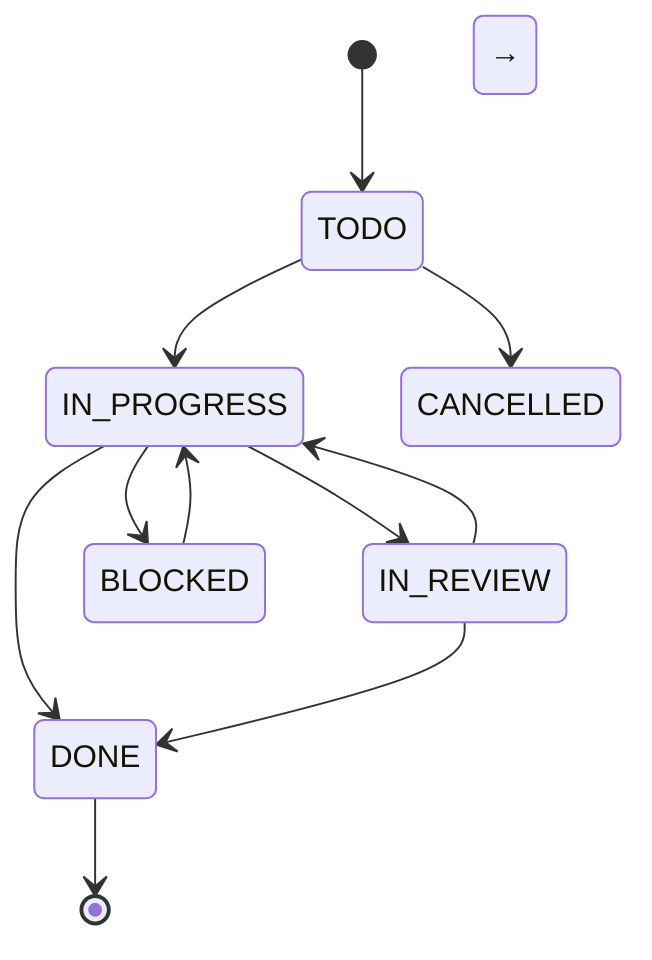
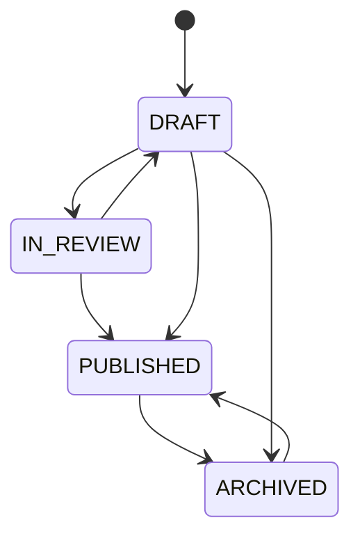
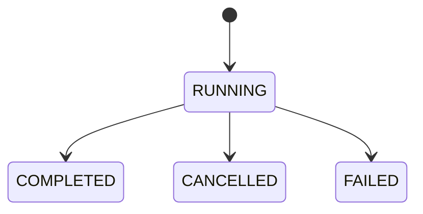
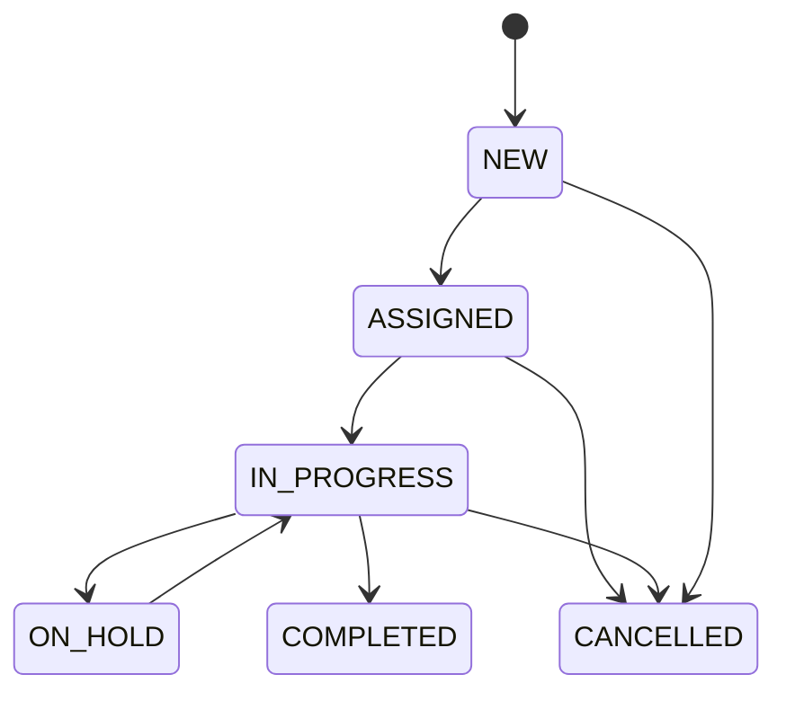
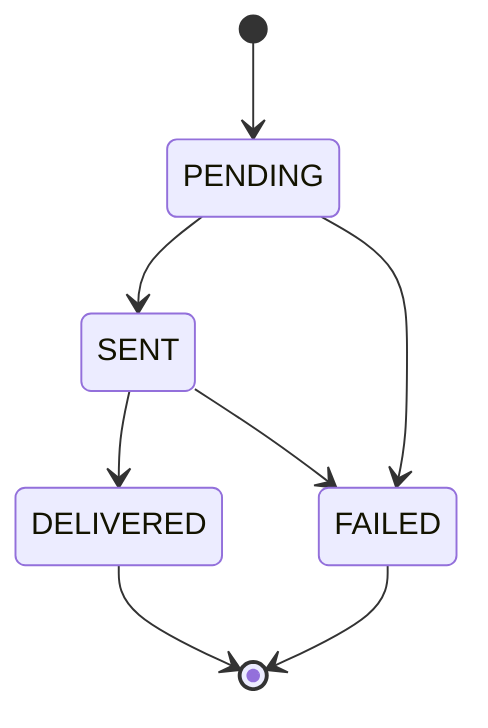
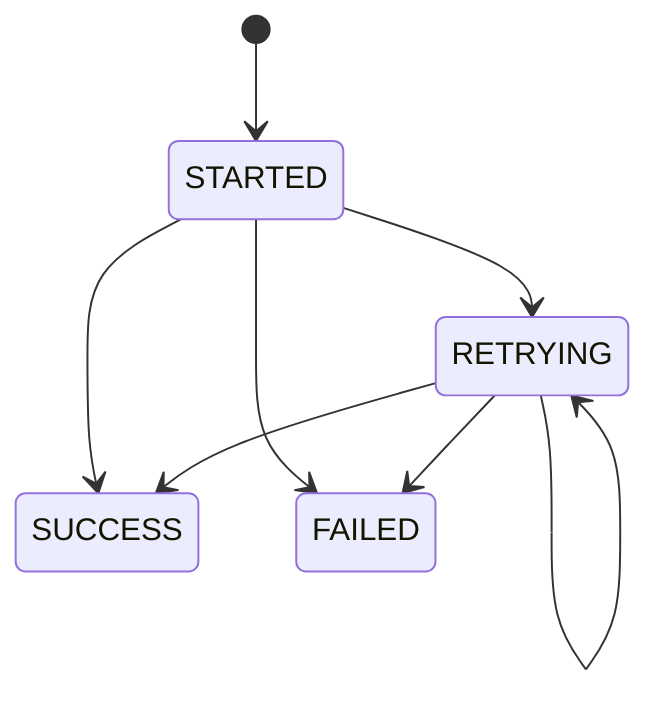
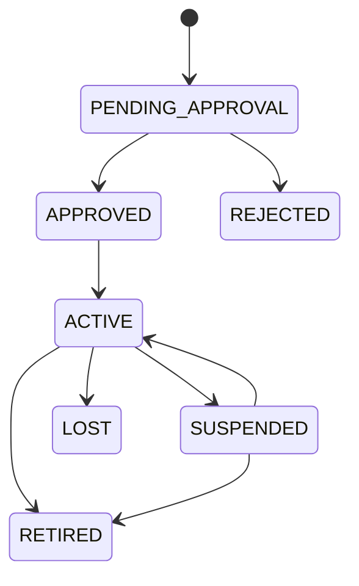
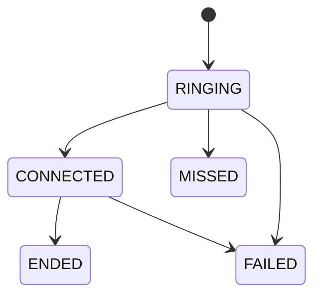
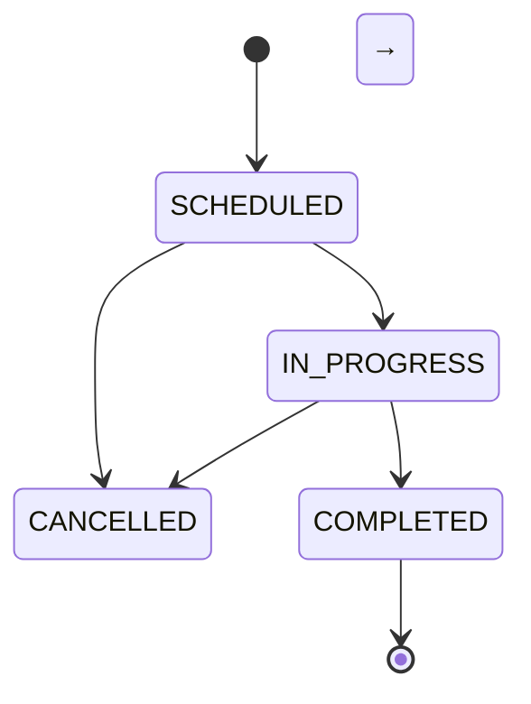

# StateMachineCatalog.md — Phase 05 state machines

**Status:** DESIGN (Phase 05) · **Spec:** `docs/Phases/Phase5.md` §13–§14, §20,
§22–§26, §28–§29, §31–§35, §39
**Machine contract (§13):** States · Allowed transitions · Forbidden
transitions · Actor · Permission · Side effects.
**Laws (§14):** states are strings or reference entities; any other value is
rejected (`INVALID_STATE_TRANSITION`); every transition is audited (AUD-001);
side effects run in the same use-case transaction or as recorded domain
events (§49).

Legend — **Actor:** who may trigger · **Perm:** permission code required
(§42) · **Guard:** domain precondition · **Effects:** mandatory side effects.

---

## 1 · Machine: Project (Project.status — enum `projectStatus`)

**States**

| State | Meaning |
|---|---|
| PLANNING | Approved idea / being planned; budget & team forming |
| ACTIVE | Executing; work orders, tasks and phases running |
| ON_HOLD | Temporarily paused (client, budget, external) |
| COMPLETED | Delivered and closed (BR-PRJ-001 — changes need special permission) |
| CANCELLED | Abandoned before completion |

| From | To | Actor | Perm | Guard | Effects |
|---|---|---|---|---|---|
| — | PLANNING | Project creator | project.create | owner set (or DRAFT exception BR-PRJ-001) | AuditEvent CREATE; event projectCreated |
| PLANNING | ACTIVE | Project manager | project.start | budget approved; ≥1 member | event projectActivated; notify members |
| PLANNING | CANCELLED | PM / admin | project.cancel | reason required | notify stakeholders; audit REJECTION/UPDATE |
| ACTIVE | ON_HOLD | PM | project.pause | reason required | event projectOnHold; open tasks flagged |
| ON_HOLD | ACTIVE | PM | project.resume | — | event projectResumed |
| ACTIVE | COMPLETED | PM | project.complete | all milestones DONE or waived | lock budget; event projectCompleted → notifications handler |
| ACTIVE / ON_HOLD | CANCELLED | PM / admin | project.cancel | reason required | soft-close open tasks; event projectCancelled |

**Forbidden:** COMPLETED → anything (error `PROJECT_ALREADY_COMPLETED` unless
special permission `project.reopen`, audited); CANCELLED → ACTIVE;
ON_HOLD → COMPLETED (must resume first).

---

## 2 · Machine: Task (Task.status — enum `taskStatus`)

**States:** TODO · IN_PROGRESS · IN_REVIEW · BLOCKED · DONE · CANCELLED

| From | To | Actor | Perm | Guard | Effects |
|---|---|---|---|---|---|
| — | TODO | Any member | task.create | projectId valid or standalone (BR-TSK-001) | event taskCreated → notification handler |
| TODO | IN_PROGRESS | Assignee / PM | task.start | assignee exists | startedAt stamp; board index touch |
| TODO | CANCELLED | PM / creator | task.cancel | — | event taskCancelled |
| IN_PROGRESS | IN_REVIEW | Assignee | task.submit | — | event taskReviewRequested |
| IN_PROGRESS | BLOCKED | Assignee | task.block | blocker reason required | event taskBlocked; notify PM |
| IN_PROGRESS | DONE | Assignee / PM | task.complete | — | completedAt; event taskCompleted (BR-NOT-001) |
| BLOCKED | IN_PROGRESS | Assignee / PM | task.unblock | blocker resolved | event taskUnblocked |
| IN_REVIEW | DONE | Reviewer | task.approve | review decision recorded | reviewer stamp; event taskCompleted |
| IN_REVIEW | IN_PROGRESS | Reviewer | task.reject | reason required (WF2-004 pattern) | rework note; event taskRejected |

**Forbidden:** DONE → any (reopen only via `task.reopen` special permission,
audited, creates new TODO row — history preserved §22); CANCELLED → any;
BLOCKED → DONE / IN_REVIEW (must unblock).

---

## 3 · Machine: Document (Document.status — enum `documentStatus`)

**States:** DRAFT · IN_REVIEW · PUBLISHED · ARCHIVED

| From | To | Actor | Perm | Guard | Effects |
|---|---|---|---|---|---|
| — | DRAFT | Author | document.create | — | DocumentVersion v1 (BR-DOC-001) |
| DRAFT | IN_REVIEW | Author | document.submit | version finalized for review | WorkflowInstance started (generic engine §34) |
| IN_REVIEW | DRAFT | Reviewer | document.reject | reason required | review record; notify author |
| IN_REVIEW | PUBLISHED | Reviewer/approver | document.approve | workflow approval complete | currentVersionNumber locked (BR-DOC-002); event documentPublished |
| DRAFT | PUBLISHED | Author (if policy allows direct) | document.publish | tenant policy allows skip-review class | audit notes direct publish |
| PUBLISHED | ARCHIVED | Archivist / PM | document.archive | — | retention clock starts (§71) |
| ARCHIVED | PUBLISHED | Archivist | document.restore | special permission | audit; event documentRestored |
| DRAFT | ARCHIVED | Author | document.archive | — | — |

**Forbidden:** PUBLISHED → DRAFT (corrections = new version, never in-place);
ARCHIVED → IN_REVIEW; version content change in any state (BR-DOC-001 —
`DOCUMENT_VERSION_IMMUTABLE`).

---

## 4 · Machine: Workflow (WorkflowInstance.status — enum `workflowInstanceStatus`)

**States:** RUNNING · COMPLETED · CANCELLED · FAILED
(WorkflowTask adds PENDING · IN_PROGRESS · DONE · SKIPPED · FAILED locally;
WorkflowDefinition/WorkflowVersion lifecycle: DRAFT → ACTIVE → INACTIVE.)

| From | To | Actor | Perm | Guard | Effects |
|---|---|---|---|---|---|
| — | RUNNING | System (engine) on business trigger | workflow.start | definition ACTIVE + version pinned (BR-WF2-002) | WorkflowTask rows created from version snapshot |
| RUNNING | COMPLETED | Engine (last approval done) | — | all required tasks DONE/SKIPPED | target entity callback (e.g. document PUBLISHED); event workflowCompleted |
| RUNNING | CANCELLED | Initiator / admin | workflow.cancel | reason recorded | event workflowCancelled; release pending tasks |
| RUNNING | FAILED | Engine / system | — | non-recoverable step error ≥ maxRetries | IntegrationError/audit entry; notify admins |

**Forbidden:** COMPLETED/CANCELLED/FAILED → RUNNING (restart = NEW instance —
history is never rewritten §34); engine hard-coding domain terms (BR-WF2-001);
mutating a running instance when its definition version is retired
(BR-WF2-002 — `INVALID_WORKFLOW_TRANSITION`).

---

## 5 · Machine: Maintenance (MaintenanceWorkOrder.status — enum `workOrderStatus`)

**States:** NEW · ASSIGNED · IN_PROGRESS · ON_HOLD · COMPLETED · CANCELLED

| From | To | Actor | Perm | Guard | Effects |
|---|---|---|---|---|---|
| — | NEW | Requester / plan generator | maintenance.request | asset/device target valid | event workOrderCreated; notify team |
| NEW | ASSIGNED | Dispatcher | maintenance.assign | technician ≠ blank | assignedAt stamp; notify technician |
| ASSIGNED | IN_PROGRESS | Technician | maintenance.start | — | startedAt; asset status note |
| ASSIGNED | CANCELLED | Dispatcher / admin | maintenance.cancel | reason required | notify technician |
| IN_PROGRESS | ON_HOLD | Technician | maintenance.pause | reason (parts/waiting) | event workOrderOnHold |
| ON_HOLD | IN_PROGRESS | Technician | maintenance.resume | — | — |
| IN_PROGRESS | COMPLETED | Technician | maintenance.complete | outcome note REQUIRED (BR-MNT-001) | labor/parts costs recorded; asset service history row; event workOrderCompleted |
| NEW | CANCELLED | Requester / dispatcher | maintenance.cancel | reason required | — |

**Forbidden:** COMPLETED → any (only `maintenance.reopen` special permission,
audited); CANCELLED → any; ON_HOLD → COMPLETED (must resume); COMPLETED
without outcome note — `WORK_ORDER_COMPLETED` guard.

---

## 6 · Machine: Notification (Notification.status + per-recipient read state)

**States (root):** PENDING · SENT · DELIVERED · FAILED
**Per-recipient (NotificationRecipient):** UNREAD → READ (isRead + readAt);
**Per-channel (NotificationDelivery):** pending → sent → delivered → read →
failed (§31).

| From | To | Actor | Perm | Guard | Effects |
|---|---|---|---|---|---|
| — (event) | PENDING | Notification handler (never domain core — BR-NOT-001) | system | domain event received | recipient rows + delivery rows created |
| PENDING | SENT | Delivery worker | system | channel dispatch OK | sentAt per delivery |
| SENT | DELIVERED | Provider callback / worker | system | provider ack | deliveredAt; retry counter cleared |
| PENDING/SENT | FAILED | Delivery worker | system | channel error after retries (BR-NOT-002) | failureReason; retry possible via new delivery row |
| UNREAD | READ | Recipient | — (own row only) | recipient-scoped object access (§44 layer 6) | readAt set on NotificationRecipient — never on root (BR-COM-008) |

**Forbidden:** read state on the Notification root (`isRead` on root forbidden);
FAILED → PENDING on the same delivery row (retry = new row, §31); deleting a
notification because delivery failed (BR-NOT-002).

---

## 7 · Machine: Integration (IntegrationExecution.status — enum §39)

**States:** STARTED · SUCCESS · FAILED · RETRYING
(Related: Integration.connectionStatus DISCONNECTED → CONNECTED → ERROR;
IntegrationEvent pending → processing → processed → failed → skipped.)

| From | To | Actor | Perm | Guard | Effects |
|---|---|---|---|---|---|
| — | STARTED | Scheduler / event | integration.execute | credential reference resolvable (BR-INT-001) | execution row + context snapshot |
| STARTED | SUCCESS | Worker | system | target ack | durationMs; payload result summary; lastRunAt on Integration |
| STARTED | FAILED | Worker | system | error | IntegrationError row with payload pointer (BR-INT-002) |
| STARTED | RETRYING | Worker | system | transient error + retries < max | retryCount++; backoff schedule |
| RETRYING | SUCCESS | Worker | system | target ack | as STARTED→SUCCESS |
| RETRYING | FAILED | Worker | system | retries exhausted or fatal | IntegrationError row; notify admins |
| RETRYING | RETRYING | Worker | system | another transient error | retryCount++ |

**Forbidden:** SUCCESS → any (execution history is append-only); deleting
failed executions (traceability §39 — BR-INT-002); duplicate processing of an
IntegrationEvent (`DUPLICATE_INTEGRATION_EVENT`, BR-INT-003).

---

## 8 · Machine: Device (Device.lifecycleStatus — enum `deviceLifecycleStatus`)

**States:** PENDING_APPROVAL · APPROVED · ACTIVE · SUSPENDED · REJECTED ·
RETIRED · LOST
(Operational ONLINE/OFFLINE is **derived**, not a state — BR-DEV-001: policy
`lastSeenAt + offlineAfterSeconds`.)

| From | To | Actor | Perm | Guard | Effects |
|---|---|---|---|---|---|
| — | PENDING_APPROVAL | Device registrar | device.register | serial/asset identifier unique per tenant | DeviceRegistration row; audit (BR-DEV-002); notify approver |
| PENDING_APPROVAL | APPROVED | IT admin | device.approve | — | credential issued (secret ref only §39); audit APPROVAL |
| PENDING_APPROVAL | REJECTED | IT admin | device.reject | reason required | audit REJECTION; registration closed |
| APPROVED | ACTIVE | Device first heartbeat | system | first valid heartbeat received | lastSeenAt initialized; event deviceActivated |
| ACTIVE | SUSPENDED | IT admin | device.suspend | reason (security etc.) | heartbeat rejects; audit |
| SUSPENDED | ACTIVE | IT admin | device.activate | re-approval per policy | audit |
| ACTIVE / SUSPENDED | RETIRED | IT admin | device.retire | — | credential revoked; kept for history (BR-AST-001 pattern) |
| ACTIVE | LOST | IT admin | device.markLost | — | credential revoked immediately; asset note |

**Forbidden:** RETIRED/LOST → ACTIVE (physical recovery = new registration
with same serial after retire, history preserved); storing `isOnline` as a
writable flag (BR-DEV-001).

---

## 9 · Machine: Call (VoiceCall/GroupCall.status — enum `callStatus`)

**States:** RINGING · CONNECTED · ENDED · FAILED · MISSED

| From | To | Actor | Perm | Guard | Effects |
|---|---|---|---|---|---|
| — | RINGING | Initiator | call.create | recipient accepts calls (presence ≠ DND) | signaling via Channels; participants invited (metadata only — BR-COM-004) |
| RINGING | CONNECTED | Recipient answers | call.answer | WebRTC session established | startedAt; participant join rows |
| RINGING | MISSED | System (timeout) | system | no answer before timeout | ringTimeout recorded; missed-call notification via handler |
| RINGING | FAILED | System / initiator | system/call.cancel | signaling or transport error | failureReason; audit |
| CONNECTED | ENDED | Either party / system | call.end | — | endedAt; durationMs computed; recording metadata finalized if any (BR-COM-005) |
| CONNECTED | FAILED | System | system | transport drop | endedAt; participants marked dropped; reconnect window |

**Forbidden:** ENDED/FAILED/MISSED → CONNECTED (a "resume" is a NEW call row);
storing audio/stream payloads in DB (BR-COM-004 — CRITICAL); recording
without consent flag (BR-COM-006).

---

## 10 · Machine: Meeting (Meeting.status — enum `meetingStatus`)

**States:** SCHEDULED · IN_PROGRESS · COMPLETED · CANCELLED

| From | To | Actor | Perm | Guard | Effects |
|---|---|---|---|---|---|
| — | SCHEDULED | Organizer | meeting.create | ≥1 attendee; room/time conflict checked | event meetingCreated → invite notifications (BR-NOT-001); calendar sync queue |
| SCHEDULED | IN_PROGRESS | Organizer / system at start time | meeting.start | within start window | startedAt; participants may join; presence channel opened |
| SCHEDULED | CANCELLED | Organizer | meeting.cancel | reason recorded | notify all attendees; release room booking; event meetingCancelled |
| IN_PROGRESS | COMPLETED | Organizer / system at end | meeting.end | — | endedAt; minutes lock; recordings finalized to object storage (BR-COM-005) + consent verified (BR-COM-006); event meetingCompleted |
| IN_PROGRESS | CANCELLED | Organizer | meeting.cancel | reason recorded | as above + abrupt-end note |

**Forbidden:** COMPLETED → IN_PROGRESS (restart = new meeting, link via
followUpMeetingId); CANCELLED → IN_PROGRESS; attendee join after COMPLETED.

---

## Secondary lifecycle machines (documented for completeness)

These status fields follow the same contract but are simple two/three-state
lifecycles; they are listed in `FieldCatalog.md` and validated by
BR-DAT-012:

| Machine | Entity | States |
|---|---|---|
| User | User | active · invited · suspended · deactivated |
| Employee | Employee | active · onLeave · terminated |
| Tenant | Tenant | active · suspended · closed |
| EvaluationCycle | EvaluationCycle | draft → active → closed → archived |
| Asset | Asset | inUse · inStock · underRepair · retired |
| Issue | Issue | open → inProgress → resolved → closed |
| Risk | Risk | open → mitigated → closed |
| Milestone | Milestone | pending → inProgress → achieved · missed |
| AiModel | AiModel | draft → active → deprecated |
| Subscription/Plan | Billing domain | per billing catalogue |

Each secondary machine: transitions audited, terminal states immutable
without special permission, invalid target rejected with
`INVALID_STATE_TRANSITION`.

---

## Cross-machine laws

1. **Transition = audited command (§58 enforcement).** Every row above maps
   to one application command with permission check (§44) + AuditEvent.
2. **Terminal states are append-only history.** COMPLETED / CANCELLED /
   RETIRED / ENDED never mutate in place; correction flows create new rows
   or new instances (§22, §34).
3. **Notifications are side effects, not in-domain calls** — machines emit
   events; the notification handler creates notifications (§36, BR-NOT-001).
4. **Workflow machine drives other machines** through the generic engine
   (§34): document publishing, purchase approvals etc. transition via
   workflow completion callbacks, never by direct status writes from the
   engine internals of another domain (§45 — cross-domain via events).
